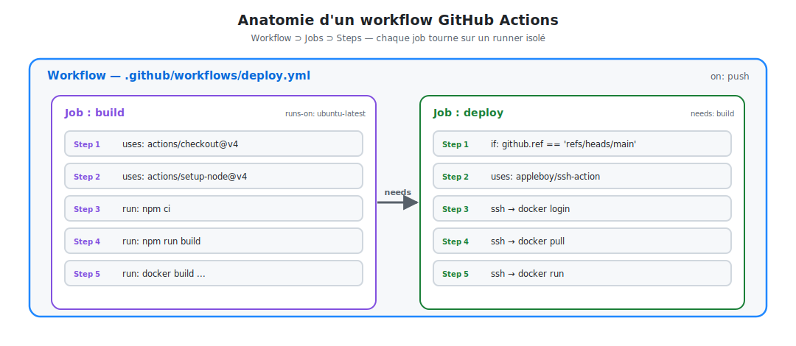
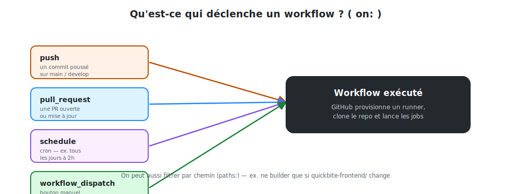

# Anatomie de GitHub Actions

Avant d'écrire une seule ligne de YAML, il faut maîtriser le **vocabulaire**. Tout
GitHub Actions repose sur cinq notions emboîtées.

## 1. Les cinq notions clés

| Notion | Définition | Analogie |
|--------|-----------|----------|
| **Workflow** | Un fichier `.yml` qui décrit un processus automatisé complet | La recette de cuisine |
| **Event** (`on:`) | L'événement qui déclenche le workflow | Le coup de sonnette |
| **Job** | Un groupe d'étapes qui s'exécutent sur **une même machine** | Une équipe en cuisine |
| **Step** | Une étape unique : une commande (`run`) ou une action (`uses`) | Un geste de la recette |
| **Runner** | La machine (VM) jetable qui exécute un job | Le plan de travail |



<p class="caption">Un workflow contient des jobs ; chaque job contient des steps et tourne sur son propre runner.</p>

### Le point le plus important à retenir

> **Chaque job démarre sur une machine neuve et isolée.** Deux jobs ne partagent ni le
> disque, ni la mémoire. Si le job `deploy` a besoin de l'image construite par le job
> `build`, il faut soit la **publier** dans un registry, soit utiliser un **artifact**.
> C'est pourquoi notre pipeline publie l'image sur GHCR entre les deux.

## 2. La structure d'un fichier de workflow

Les workflows vivent dans le dossier **`.github/workflows/`** à la racine du dépôt.
Voici le squelette minimal commenté :

```yaml
name: Mon pipeline            # Nom affiché dans l'onglet "Actions"

on:                           # ── ÉVÉNEMENT : quand déclencher ?
  push:
    branches: [main]

jobs:                         # ── JOBS : un ou plusieurs
  build:                      # identifiant du job
    runs-on: ubuntu-latest    # le RUNNER
    steps:                    # ── STEPS : les étapes
      - uses: actions/checkout@v4        # une ACTION réutilisable
      - run: echo "Bonjour depuis le CI" # une COMMANDE shell
```

- **`uses:`** → réutilise une **action** publiée (du Marketplace ou d'un autre dépôt).
  Exemple : `actions/checkout@v4` clone votre code sur le runner.
- **`run:`** → exécute une **commande shell** sur le runner.

## 3. Les événements déclencheurs (`on:`)

Un workflow ne fait rien tant qu'un **événement** ne survient pas. Les plus courants :



<p class="caption">push, pull_request, schedule, workflow_dispatch : autant de portes d'entrée vers le même workflow.</p>

```yaml
on:
  push:
    branches: [main, develop]      # uniquement sur ces branches
    paths:
      - 'quickbite-frontend/**'    # ...et seulement si ce dossier change
  pull_request:
    branches: [main]               # à l'ouverture/màj d'une PR vers main
  schedule:
    - cron: '0 2 * * *'            # tous les jours à 02h00 UTC
  workflow_dispatch:               # bouton "Run workflow" manuel
```

> **Astuce `paths:`** — dans un *monorepo* qui contient le front, le back et la doc,
> `paths:` évite de relancer tout le pipeline frontend quand seul le backend change.
> C'est exactement ce que fait notre projet QuickBite.

## 4. Actions, runners et Marketplace

### Les runners

`runs-on: ubuntu-latest` demande à GitHub une **VM Ubuntu jetable**, déjà équipée de
Git, Docker, Node, etc. Elle est **créée pour le job puis détruite** — aucune trace, aucune
donnée résiduelle. (Pour des besoins spécifiques, on peut héberger ses propres
*self-hosted runners*.)

### Les actions réutilisables

Une **action** est un composant packagé que l'on branche avec `uses:`. On épingle
toujours une **version** (`@v4`) pour la reproductibilité.

| Action | Rôle |
|--------|------|
| `actions/checkout@v4` | Cloner le dépôt sur le runner |
| `actions/setup-node@v4` | Installer Node.js (+ cache npm) |
| `docker/setup-buildx-action@v3` | Activer le builder Docker avancé |
| `docker/build-push-action@v6` | Builder **et** pousser une image |
| `docker/login-action@v3` | S'authentifier sur un registry |
| `appleboy/ssh-action@v1` | Exécuter des commandes via SSH |

## 5. Le cycle de vie résumé

1. **Événement** — quelqu'un pousse du code → GitHub détecte `on: push`.
2. **Provisioning** — GitHub alloue un runner neuf par job.
3. **Exécution** — chaque step s'exécute dans l'ordre ; si une step échoue, le job
   s'arrête (sauf `continue-on-error: true`).
4. **Dépendances** — `needs:` enchaîne les jobs ; sinon ils tournent **en parallèle**.
5. **Résultat** — ✅ ou ❌ visible sur le commit, la PR et l'onglet *Actions*.
6. **Nettoyage** — les runners sont détruits.
