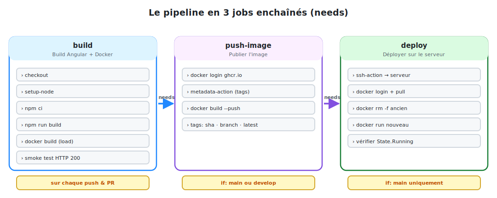

# Le workflow CI/CD complet

Nous assemblons maintenant tout : un pipeline en **trois jobs enchaînés** qui builde,
publie et déploie l'application. C'est le workflow réel du projet **QuickBite**.

## 1. La stratégie en trois jobs



<p class="caption">build (sur chaque push/PR) → push-image (main/develop) → deploy (main seulement), reliés par needs.</p>

| Job | Quand ? | Rôle |
|-----|---------|------|
| `build` | chaque `push` et chaque `pull_request` | Compiler Angular, builder l'image, **smoke test** |
| `push-image` | seulement sur `main` ou `develop` | Publier l'image taguée sur **GHCR** |
| `deploy` | seulement sur `main` | Se connecter en **SSH** et lancer l'image sur le serveur |

> **Pourquoi séparer ?** On veut **valider chaque PR** (job `build`) sans pour autant
> publier ni déployer. Seuls les vrais changements fusionnés sur `main` vont en production.
> Les conditions `if:` réalisent ce filtrage.

## 2. L'en-tête : déclencheurs et variables

```yaml
name: QuickBite Frontend — CI/CD

on:
  push:
    branches: [main, develop]
    paths:
      - 'quickbite-frontend/**'                    # ne builder que si le front change
      - '.github/workflows/frontend-deploy.yml'
  pull_request:
    branches: [main]
    paths:
      - 'quickbite-frontend/**'

env:                                               # variables réutilisées partout
  REGISTRY: ghcr.io
  IMAGE_NAME: quickbite-frontend
  DOCKERFILE_PATH: quickbite-frontend/Dockerfile
  CONTEXT_PATH: quickbite-frontend
```

Le bloc **`env:`** au niveau du workflow définit des variables disponibles dans tous les
jobs via `${{ env.NOM }}` — pas de répétition, un seul endroit à modifier.

## 3. Job 1 — Build, image Docker & smoke test

```yaml
jobs:
  build:
    name: Build Angular + Docker
    runs-on: ubuntu-latest
    timeout-minutes: 15

    steps:
      - name: Checkout code
        uses: actions/checkout@v4

      - name: Setup Node.js 20
        uses: actions/setup-node@v4
        with:
          node-version: 20
          cache: 'npm'                             # met en cache ~/.npm
          cache-dependency-path: ${{ env.CONTEXT_PATH }}/package-lock.json

      - name: Install dependencies
        run: npm ci
        working-directory: ${{ env.CONTEXT_PATH }}

      - name: Build Angular (production)
        run: npm run build
        working-directory: ${{ env.CONTEXT_PATH }}

      - name: Setup Docker Buildx
        uses: docker/setup-buildx-action@v3

      - name: Build Docker image (sans push)
        uses: docker/build-push-action@v6
        with:
          context: ${{ env.CONTEXT_PATH }}
          file: ${{ env.DOCKERFILE_PATH }}
          tags: ${{ env.IMAGE_NAME }}:${{ github.sha }}
          load: true                               # charge l'image localement
          cache-from: type=gha                     # réutilise le cache GitHub Actions
          cache-to: type=gha,mode=max
```

### Le smoke test : vérifier que l'image démarre vraiment

On ne se contente pas de builder : on **lance le conteneur** et on vérifie qu'il répond
en HTTP 200. Un build qui compile mais ne démarre pas serait inutile.

```yaml
      - name: Smoke test — démarrer le conteneur et vérifier HTTP 200
        run: |
          docker run -d -p 8080:80 --name smoke-test ${{ env.IMAGE_NAME }}:${{ github.sha }}
          sleep 3
          STATUS=$(curl -s -o /dev/null -w "%{http_code}" http://localhost:8080/)
          docker logs smoke-test
          docker rm -f smoke-test
          if [ "$STATUS" != "200" ]; then
            echo "Smoke test failed: HTTP $STATUS"
            exit 1                                  # fait échouer le job → bloque le déploiement
          fi
          echo "Smoke test passed: HTTP $STATUS"
```

> **`${{ github.sha }}`** est le hash du commit. Taguer l'image avec lui rend **chaque
> build traçable** : on sait exactement quel commit tourne en production.

## 4. Job 2 — Publier l'image sur le registry

```yaml
  push-image:
    name: Push image to Registry
    needs: build                                   # n'exécute QUE si "build" a réussi
    if: github.ref == 'refs/heads/main' || github.ref == 'refs/heads/develop'
    runs-on: ubuntu-latest

    steps:
      - uses: actions/checkout@v4
      - uses: docker/setup-buildx-action@v3

      - name: Log in to GitHub Container Registry
        uses: docker/login-action@v3
        with:
          registry: ${{ env.REGISTRY }}
          username: ${{ github.actor }}
          password: ${{ secrets.GITHUB_TOKEN }}    # token fourni automatiquement

      - name: Extraire les métadonnées (tags, labels)
        id: meta
        uses: docker/metadata-action@v5
        with:
          images: ${{ env.REGISTRY }}/${{ github.repository }}/${{ env.IMAGE_NAME }}
          tags: |
            type=sha,prefix=,suffix=,format=short  # tag = hash court du commit
            type=ref,event=branch                  # tag = nom de la branche
            type=raw,value=latest,enable=${{ github.ref == 'refs/heads/main' }}

      - name: Build & Push image
        uses: docker/build-push-action@v6
        with:
          context: ${{ env.CONTEXT_PATH }}
          file: ${{ env.DOCKERFILE_PATH }}
          push: true                               # cette fois on POUSSE
          tags: ${{ steps.meta.outputs.tags }}
          labels: ${{ steps.meta.outputs.labels }}
          cache-from: type=gha
          cache-to: type=gha,mode=max
```

- **`needs: build`** crée la dépendance : `push-image` attend la réussite de `build`.
- **`steps.meta.outputs.tags`** récupère la sortie de la step `id: meta` — c'est ainsi
  qu'on **passe une valeur d'une step à une autre**.

## 5. Job 3 — Déploiement (aperçu)

Le troisième job se connecte au serveur en SSH pour y lancer la nouvelle image. Il est
suffisamment important pour avoir **son propre module** : voir le module suivant.

```yaml
  deploy:
    name: Deploy on server
    needs: push-image
    if: github.ref == 'refs/heads/main'            # production = main uniquement
    runs-on: ubuntu-latest
    steps:
      - uses: actions/checkout@v4
      - name: Déploiement via SSH
        uses: appleboy/ssh-action@v1.2.2
        with:
          host: ${{ secrets.DEPLOY_HOST }}
          username: ${{ secrets.DEPLOY_USER }}
          key: ${{ secrets.DEPLOY_SSH_KEY }}
          script: |
            # ... pull + run de l'image (détaillé au module 05)
```

## 6. Où placer le fichier ?

```
mon-projet/
└── .github/
    └── workflows/
        └── frontend-deploy.yml   ← le workflow complet
```

Dès le prochain `git push` sur `main`, ouvrez l'onglet **Actions** du dépôt : vous verrez
les trois jobs s'enchaîner en direct.
