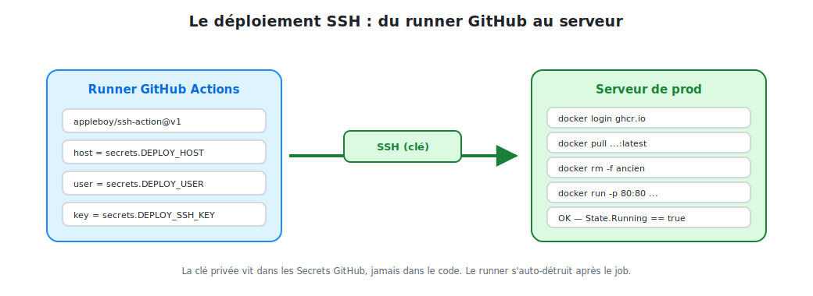

# Le déploiement SSH sur le serveur

Le job `deploy` est le maillon final : il transforme une image publiée en un **conteneur
qui tourne en production**. Tout se joue à travers une connexion SSH.

## 1. Le principe



<p class="caption">Le runner ouvre un tunnel SSH (authentifié par clé), puis le serveur télécharge et lance l'image.</p>

Le runner GitHub **ne déploie pas lui-même** : il **donne des ordres** au serveur via SSH.
C'est le serveur qui télécharge l'image depuis GHCR et lance le conteneur. Le runner,
lui, est détruit aussitôt après.

## 2. Le job complet

```yaml
  deploy:
    name: Deploy on server
    needs: push-image
    if: github.ref == 'refs/heads/main'
    runs-on: ubuntu-latest
    timeout-minutes: 10

    steps:
      - name: Checkout code
        uses: actions/checkout@v4

      - name: Déploiement via SSH
        uses: appleboy/ssh-action@v1.2.2
        with:
          host: ${{ secrets.DEPLOY_HOST }}
          username: ${{ secrets.DEPLOY_USER }}
          key: ${{ secrets.DEPLOY_SSH_KEY }}
          port: ${{ secrets.DEPLOY_PORT || '22' }}
          script: |
            set -e        # arrête le script à la première erreur
            # ... voir détail ci-dessous
```

- **`appleboy/ssh-action`** ouvre la connexion SSH avec les secrets et exécute le `script:`
  **sur le serveur distant**.
- **`${{ secrets.DEPLOY_PORT || '22' }}`** — l'opérateur `||` fournit une valeur par
  défaut si le secret n'est pas défini.
- **`set -e`** garantit qu'une commande qui échoue **fait échouer tout le déploiement**.

## 3. Le script exécuté sur le serveur

```bash
set -e

# 1) S'authentifier sur le registry GHCR
echo "${{ secrets.GITHUB_TOKEN }}" | docker login ghcr.io -u ${{ github.actor }} --password-stdin

# 2) Télécharger la dernière image
docker pull ${{ env.REGISTRY }}/${{ github.repository }}/${{ env.IMAGE_NAME }}:latest

# 3) Arrêter et supprimer l'ancien conteneur (sans planter s'il n'existe pas)
docker rm -f quickbite-frontend 2>/dev/null || true

# 4) Lancer le nouveau conteneur
docker run -d \
  --name quickbite-frontend \
  --restart unless-stopped \
  -p 80:80 \
  -p 443:443 \
  ${{ env.REGISTRY }}/${{ github.repository }}/${{ env.IMAGE_NAME }}:latest

# 5) Nettoyer les anciennes images (libère le disque)
docker image prune -af

# 6) Vérifier que le conteneur tourne réellement
sleep 3
if [ "$(docker inspect -f '{{.State.Running}}' quickbite-frontend)" != "true" ]; then
  echo "Le conteneur ne tourne pas !"
  docker logs quickbite-frontend
  exit 1
fi
echo "Déploiement réussi !"
```

### Les six étapes décortiquées

| # | Étape | Pourquoi |
|---|-------|----------|
| 1 | `docker login ghcr.io` | L'image est privée par défaut ; il faut s'authentifier pour la `pull` |
| 2 | `docker pull` | Récupère la **dernière** version publiée par le job précédent |
| 3 | `docker rm -f` | Libère le nom et les ports ; `|| true` évite l'échec si absent |
| 4 | `docker run` | Démarre la nouvelle version |
| 5 | `docker image prune` | Évite la saturation du disque par les vieilles images |
| 6 | `docker inspect` | **Vérification finale** : le job échoue si le conteneur ne tourne pas |

## 4. Les options clés de `docker run`

- **`-d`** : mode détaché (le conteneur tourne en arrière-plan).
- **`--restart unless-stopped`** : le conteneur **redémarre tout seul** si le serveur
  reboote ou si le processus plante. Essentiel en production.
- **`-p 80:80 -p 443:443`** : expose les ports HTTP/HTTPS du serveur vers le conteneur.
- **`--name`** : un nom fixe pour pouvoir le retrouver, l'arrêter et le remplacer.

## 5. Stratégie de déploiement : « stop puis start »

Ce script applique un déploiement simple : on **arrête** l'ancien conteneur puis on
**démarre** le nouveau. Il y a une **micro-coupure** (quelques secondes) le temps du
redémarrage.

| Stratégie | Coupure | Complexité |
|-----------|---------|-----------|
| **Stop & Start** (ce cours) | quelques secondes | très simple ✅ |
| **Blue-Green** | zéro | il faut un reverse-proxy qui bascule |
| **Rolling** (orchestrateur) | zéro | nécessite Docker Swarm / Kubernetes |

> Pour un site vitrine ou une app interne, *stop & start* est parfaitement acceptable.
> Le **healthcheck** de l'étape 6 garantit qu'on détecte immédiatement un démarrage raté.

## 6. Vérifier le déploiement

Après un run réussi, sur le serveur :

```bash
docker ps                                  # le conteneur doit être "Up"
curl -I http://localhost                   # doit répondre HTTP/1.1 200 OK
docker logs quickbite-frontend --tail 20   # logs Nginx
```

Et bien sûr : ouvrir le domaine du serveur dans un navigateur. Le nouveau code est en
ligne — **sans aucune intervention manuelle**.
