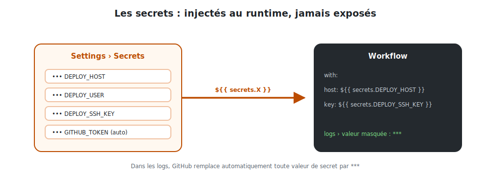

# Secrets, registry & sécurité

Un pipeline manipule des **clés SSH**, des **tokens** et des **identifiants de registry**.
Ce module explique comment GitHub les protège et comment publier proprement sur GHCR.

## 1. Comment fonctionnent les secrets



<p class="caption">Les secrets sont stockés chiffrés, injectés dans le runner à l'exécution, et masqués (***) dans les logs.</p>

| Principe | Détail |
|----------|--------|
| **Chiffrés au repos** | Stockés chiffrés dans GitHub ; illisibles une fois enregistrés |
| **Injectés au runtime** | Disponibles seulement pendant le job, via `${{ secrets.X }}` |
| **Masqués dans les logs** | Toute valeur de secret affichée devient `***` automatiquement |
| **Cloisonnés** | Non transmis aux workflows déclenchés par des PR de *forks* externes |

```yaml
with:
  host: ${{ secrets.DEPLOY_HOST }}
  key:  ${{ secrets.DEPLOY_SSH_KEY }}
# Dans les logs : host: ***   key: ***
```

> **À ne jamais faire :** écrire une clé ou un mot de passe en clair dans le YAML, ou faire
> `echo "$MA_CLE"` pour « déboguer ». Si un secret se retrouve dans l'historique Git,
> considérez-le **compromis** et **révoquez-le** immédiatement.

## 2. `GITHUB_TOKEN` : le secret automatique

GitHub crée **automatiquement** un secret `GITHUB_TOKEN` pour chaque exécution de workflow.
Inutile de le générer ou de le stocker.

- Il s'authentifie auprès de l'API GitHub et du registry **GHCR** du dépôt.
- Il est **éphémère** : valable uniquement le temps du job, puis révoqué.
- Ses permissions se règlent finement avec le bloc `permissions:`.

```yaml
permissions:
  contents: read      # lire le code
  packages: write     # publier des images sur GHCR
```

> **Principe du moindre privilège :** ne donnez que les permissions nécessaires. Pour
> publier une image, `packages: write` suffit.

## 3. Publier sur GHCR (GitHub Container Registry)

**GHCR** (`ghcr.io`) est le registry d'images Docker intégré à GitHub. L'image est rangée
« à côté » du code, avec les mêmes droits d'accès.

```yaml
- name: Log in to GitHub Container Registry
  uses: docker/login-action@v3
  with:
    registry: ghcr.io
    username: ${{ github.actor }}        # l'auteur du push
    password: ${{ secrets.GITHUB_TOKEN }} # le token automatique
```

L'image publiée s'appelle :

```
ghcr.io/<organisation>/<depot>/quickbite-frontend:<tag>
```

### Bien taguer ses images

`docker/metadata-action` génère plusieurs tags d'un coup :

| Tag | Exemple | Usage |
|-----|---------|-------|
| hash du commit | `a1b2c3d` | **traçabilité** : revenir précisément à une version |
| nom de branche | `main`, `develop` | dernier état d'une branche |
| `latest` | `latest` | la dernière prod (uniquement depuis `main`) |

> **Bonne pratique :** déployez de préférence par **hash de commit** plutôt que `latest`.
> `latest` est pratique mais ambigu (« quelle version exactement ? ») ; le hash, lui, est
> sans équivoque et permet un *rollback* fiable.

## 4. Variables vs secrets

GitHub distingue deux types de configuration (**Settings ▸ Secrets and variables**) :

| | **Secrets** | **Variables** |
|---|------------|---------------|
| Pour | clés, tokens, mots de passe | config non sensible |
| Visible | non, masqué `***` | oui, en clair dans les logs |
| Accès | `${{ secrets.X }}` | `${{ vars.X }}` |
| Exemple | `DEPLOY_SSH_KEY` | `NODE_VERSION`, `API_URL` publique |

## 5. Les environnements protégés (`environment:`)

Pour la production, on peut exiger une **validation manuelle** avant le déploiement. On
crée un *environment* (**Settings ▸ Environments**) avec des **required reviewers**, puis :

```yaml
  deploy:
    environment: production    # déclenche une approbation manuelle
    runs-on: ubuntu-latest
    steps:
      - ...
```

Le job `deploy` reste alors **en attente** jusqu'à ce qu'un relecteur autorisé clique sur
« Approve ». Idéal pour garder un humain dans la boucle avant la prod.

## 6. Checklist sécurité

- [ ] Aucun secret en clair dans le code ni dans l'historique Git.
- [ ] Clé SSH **dédiée** au déploiement (révocable indépendamment).
- [ ] `permissions:` réduites au strict nécessaire.
- [ ] Déploiement par **hash de commit** pour un rollback fiable.
- [ ] Production protégée par un **environment** avec approbation (si critique).
- [ ] Images privées sur GHCR sauf besoin explicite de les rendre publiques.
