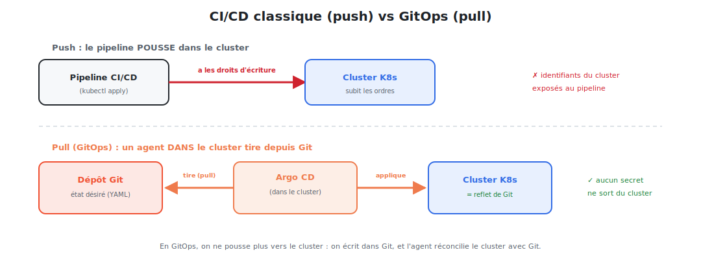

# Introduction : qu'est-ce que le GitOps ?

## 1. Le problème : « qui a déployé quoi, et comment ? »

Vous avez un cluster Kubernetes. Les déploiements se font par `kubectl apply`, des scripts,
parfois une modification manuelle « en urgence ». Très vite :

- **Personne ne sait** ce qui tourne réellement dans le cluster.
- Un `kubectl edit` en pleine nuit crée une **dérive** invisible : le cluster ne correspond
  plus à aucun fichier connu.
- **Reproduire** l'environnement (ou en recréer un après incident) relève de l'archéologie.
- Le **pipeline CI/CD** détient les **identifiants du cluster** — une cible de choix.
- Revenir à l'état d'avant un déploiement raté est **manuel** et stressant.

> Le manque, c'est une **source de vérité unique** et un mécanisme qui garantit que le
> cluster **lui ressemble en permanence**.

## 2. La solution : le GitOps

> **GitOps** est une méthode d'exploitation où **Git est la source de vérité unique** de
> l'infrastructure. L'état désiré du système est **décrit dans un dépôt Git**, et un **agent
> dans le cluster** s'assure en continu que l'état réel **correspond** à Git.

Les quatre principes (formalisés par l'OpenGitOps) :

| Principe | Signification |
|----------|---------------|
| **Déclaratif** | tout l'état est décrit en YAML (pas de scripts impératifs) |
| **Versionné & immuable** | l'état vit dans Git : historisé, signé, auditable |
| **Tiré automatiquement** | un agent récupère (pull) l'état désiré depuis Git |
| **Réconcilié en continu** | l'agent corrige sans cesse les écarts cluster ↔ Git |

## 3. Le changement de modèle : du push au pull

En GitOps, on n'écrit plus vers le cluster : on écrit dans Git, et l'agent réconcilie le cluster.

| | CI/CD classique (**push**) | GitOps (**pull**) |
|---|----------------------------|-------------------|
| Qui applique ? | le pipeline, depuis l'extérieur | un agent **dans** le cluster |
| Secrets du cluster | exposés au pipeline | **ne sortent jamais** du cluster |
| Source de vérité | dispersée (scripts, mémoire) | **Git**, unique |
| Dérive manuelle | non détectée | **détectée et corrigée** |
| Rollback | manuel | `git revert` |

## 4. Argo CD : l'agent GitOps

Ce cours utilise **Argo CD**, l'outil GitOps le plus répandu pour Kubernetes (projet CNCF).
Argo CD tourne **dans** le cluster, surveille un dépôt Git, et **synchronise** les manifestes
qu'il y trouve vers le cluster.

> Alternative notable : **Flux**. Les principes sont identiques ; Argo CD se distingue par
> une **interface graphique** riche qui rend le concept très visuel — idéal pour apprendre.

## 5. Ce que le GitOps apporte concrètement

| Bénéfice | Pourquoi |
|----------|----------|
| **Traçabilité totale** | chaque changement = un commit (qui, quoi, quand, pourquoi) |
| **Rollback trivial** | revenir en arrière = `git revert` |
| **Pas de dérive** | l'agent réaligne le cluster sur Git automatiquement |
| **Reproductibilité** | recréer un cluster = pointer Argo CD sur le dépôt |
| **Sécurité** | les identifiants du cluster restent dans le cluster |
| **Revue de code** | un déploiement passe par une **Pull Request** |

## 6. Notre fil rouge : déployer nginx en GitOps

Comme dans les cours précédents, **nginx** sert d'exemple. On va :

1. comprendre les **principes** GitOps et la boucle de réconciliation ;
2. installer **Argo CD** et découvrir son architecture ;
3. créer une **Application** Argo CD qui déploie nginx depuis Git ;
4. maîtriser la **synchronisation**, l'**auto-réparation** et le **rollback** ;
5. structurer un **dépôt** multi-environnements (dev/staging/prod) ;
6. appliquer les **bonnes pratiques** (secrets, App of Apps, sécurité).

## 7. Où le GitOps s'inscrit dans la chaîne

Le GitOps **complète** ce que vous connaissez déjà :

- **CI** (GitHub Actions) construit l'image et la pousse sur un registry, puis **met à jour
  un manifeste dans Git** (le nouveau tag d'image).
- **GitOps** (Argo CD) détecte ce changement dans Git et **déploie** sur le cluster.

> La frontière est nette : la **CI** s'arrête à Git ; le **CD** (GitOps) part de Git. Le
> pipeline n'a **plus besoin** d'accéder au cluster.

> **Pré-requis :** Kubernetes (Pods, Deployments, Services) et des bases de Git. Helm est
> un plus (Argo CD sait déployer des charts). Place aux principes, en détail.
