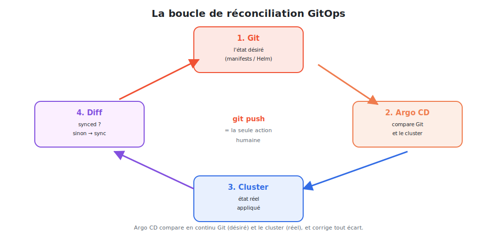

# Les principes du GitOps

Avant l'outil, la **méthode**. Le GitOps tient en une idée — Git fait foi — et une
mécanique — la **boucle de réconciliation**.



<p class="caption">Argo CD compare en continu Git (désiré) et le cluster (réel), et corrige tout écart.</p>

## 1. Git, source de vérité unique

En GitOps, **rien** ne se déploie en dehors de Git. L'état complet du système — Deployments,
Services, ConfigMaps, Ingress… — est décrit dans un **dépôt Git**.

| Conséquence | Bénéfice |
|-------------|----------|
| Tout changement passe par un **commit** | historique complet, qui/quoi/quand |
| Un déploiement = une **Pull Request** | revue, validation, discussion |
| L'état est **versionné** | on peut comparer, revenir, auditer |
| Le dépôt **décrit** l'infra | recréer un cluster = repartir du dépôt |

> **La règle d'or :** si ce n'est pas dans Git, ça ne devrait pas être dans le cluster. Le
> dépôt est la **seule** interface de déploiement.

## 2. La boucle de réconciliation

C'est le cœur du GitOps. Un agent (Argo CD) exécute **en permanence** :

1. **Observer Git** : quel est l'état **désiré** ? (les YAML du dépôt)
2. **Observer le cluster** : quel est l'état **réel** ? (les objets en place)
3. **Comparer** (diff) : y a-t-il un écart ?
4. **Réconcilier** : si écart, **appliquer Git** pour réaligner le cluster.

Puis on recommence, indéfiniment. C'est le même principe que les **contrôleurs**
Kubernetes (état désiré → état réel), mais étendu à **Git**.

```
        ┌──────────── git push (la seule action humaine) ───────────┐
        │                                                            │
   [ Dépôt Git ] ──► [ Argo CD compare ] ──► [ Cluster ] ──► [ diff ]┘
    état désiré          (réconcilie)         état réel
```

## 3. Déclaratif, pas impératif

| Impératif (à éviter) | Déclaratif (GitOps) |
|----------------------|---------------------|
| `kubectl scale deploy/nginx --replicas=5` | écrire `replicas: 5` dans le YAML, committer |
| `kubectl set image ...` | modifier le tag d'image dans Git |
| une commande, un effet ponctuel | un **état** que l'agent maintient |

On ne décrit plus **les étapes** (« fais ceci, puis cela »), mais **le résultat voulu**
(« voici à quoi le système doit ressembler »). L'agent se charge du **comment**.

## 4. La fin de la dérive de configuration

La **dérive** (configuration drift), c'est quand le cluster s'éloigne de ce qui est écrit :
un `kubectl edit` d'urgence, une modification « temporaire » oubliée…

En GitOps, l'agent **détecte** cette dérive (le cluster ≠ Git) et peut la **corriger
automatiquement** (auto-réparation). Le cluster **converge toujours** vers Git.

> **Exemple :** quelqu'un passe nginx à 10 réplicas avec `kubectl scale`. Argo CD voit que
> Git dit 3, marque l'application **OutOfSync**, et (si l'auto-heal est actif) **revient à
> 3**. Pour vraiment passer à 10, il faut **modifier Git**.

## 5. Les deux dépôts : application vs configuration

Une bonne pratique GitOps **sépare** le code applicatif de la configuration de déploiement :

| Dépôt | Contient | Modifié par |
|-------|----------|-------------|
| **dépôt applicatif** | le code source, le Dockerfile | les développeurs |
| **dépôt de config** (GitOps) | les manifestes K8s / Helm values | la CI (tag d'image) + les ops |

La CI construit l'image, la pousse, puis **met à jour le tag** dans le dépôt de config.
Argo CD, qui surveille ce dépôt, déploie la nouvelle version. Les responsabilités sont nettes.

## 6. Ce que le GitOps n'est PAS

- **≠ « juste mettre ses YAML sur GitHub ».** Sans agent de réconciliation, il n'y a pas de
  garantie que le cluster suive Git.
- **≠ un simple `kubectl apply` dans un pipeline.** Le push reste impératif et ponctuel ;
  le GitOps **observe et corrige en continu**.
- **≠ réservé aux gros clusters.** Le bénéfice (traçabilité, rollback, pas de dérive) vaut
  dès le premier environnement.

## 7. Récapitulatif

| Principe | En une phrase |
|----------|---------------|
| Source de vérité | **Git** décrit tout l'état désiré |
| Déclaratif | on décrit le **résultat**, pas les étapes |
| Pull | un **agent dans le cluster** tire depuis Git |
| Réconciliation | l'agent **maintient** cluster = Git en continu |
| Anti-dérive | toute modification hors Git est détectée (et corrigée) |

> **À retenir :** GitOps = Git comme unique source de vérité + une boucle de réconciliation
> qui aligne sans cesse le cluster sur Git. Le module suivant met cela en œuvre avec
> **Argo CD**.
