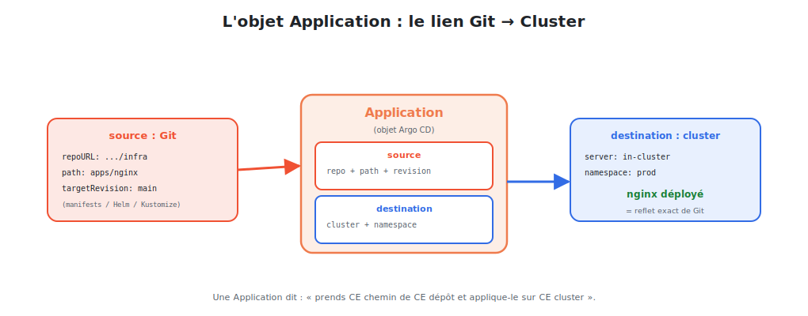

# L'objet Application : déployer nginx

L'**Application** est l'objet central d'Argo CD. Il fait le lien entre **un chemin dans
Git** (l'état désiré) et **un cluster + namespace** (où déployer).



<p class="caption">Une Application dit : « prends CE chemin de CE dépôt et applique-le sur CE cluster ».</p>

## 1. Anatomie d'une Application

```yaml
apiVersion: argoproj.io/v1alpha1
kind: Application
metadata:
  name: nginx
  namespace: argocd
spec:
  project: default

  source:                                   # ── D'OÙ vient l'état désiré
    repoURL: https://github.com/mon-orga/quickbite-config
    path: apps/nginx                        # le dossier dans le dépôt
    targetRevision: main                    # branche, tag ou commit

  destination:                              # ── OÙ déployer
    server: https://kubernetes.default.svc  # le cluster (ici, local)
    namespace: prod

  syncPolicy:                               # ── COMMENT synchroniser
    automated:
      prune: true                           # supprimer ce qui disparaît de Git
      selfHeal: true                        # corriger les dérives manuelles
    syncOptions:
      - CreateNamespace=true                # créer le namespace si absent
```

## 2. Les trois blocs essentiels

| Bloc | Répond à | Champs clés |
|------|----------|-------------|
| `source` | **D'où ?** | `repoURL`, `path`, `targetRevision` |
| `destination` | **Où ?** | `server` (cluster), `namespace` |
| `syncPolicy` | **Comment ?** | `automated`, `prune`, `selfHeal` |

> **`targetRevision`** mérite attention : `main` suit la branche (déploie chaque commit) ;
> un **tag** (`v1.2.0`) ou un **commit** fige une version précise — utile pour la prod.

## 3. Créer l'Application

Trois façons, pour le même résultat.

### En YAML (recommandé — c'est du GitOps jusqu'au bout)

```bash
kubectl apply -f nginx-application.yaml
```

### En CLI

```bash
argocd app create nginx \
  --repo https://github.com/mon-orga/quickbite-config \
  --path apps/nginx \
  --dest-server https://kubernetes.default.svc \
  --dest-namespace prod \
  --sync-policy automated
```

### Dans l'UI

**+ New App**, remplir source/destination/sync, **Create**.

## 4. Le dossier `apps/nginx` dans Git

L'Application pointe `path: apps/nginx`. Ce dossier contient l'état désiré de nginx —
de simples manifestes :

```
quickbite-config/
└── apps/
    └── nginx/
        ├── deployment.yaml      # le Deployment nginx (3 réplicas)
        ├── service.yaml         # le Service
        └── ingress.yaml         # l'Ingress
```

…ou un **chart Helm** :

```yaml
spec:
  source:
    repoURL: https://github.com/mon-orga/quickbite-config
    path: charts/nginx
    helm:
      valueFiles:
        - values-prod.yaml        # Argo CD exécute helm template avec ces values
```

## 5. Suivre l'état de l'Application

```bash
argocd app get nginx              # état sync + santé + ressources
argocd app list                   # toutes les applications
argocd app resources nginx        # l'arbre des objets gérés
```

Deux états indépendants, à bien distinguer :

| État | Question | Valeurs |
|------|----------|---------|
| **Sync** | le cluster correspond-il à Git ? | `Synced` / `OutOfSync` |
| **Health** | les ressources fonctionnent-elles ? | `Healthy` / `Progressing` / `Degraded` |

> Une application peut être **Synced mais Degraded** (le cluster reflète Git, mais un Pod
> nginx plante) — ou **OutOfSync mais Healthy** (ça tourne, mais une dérive existe). Les
> deux axes sont complémentaires.

## 6. Le déploiement, désormais, c'est un commit

Une fois l'Application en place avec `automated`, **modifier nginx = modifier Git** :

```bash
# Passer nginx de 3 à 5 réplicas
# → on édite apps/nginx/deployment.yaml (replicas: 5) dans Git
git add apps/nginx/deployment.yaml
git commit -m "nginx: 3 → 5 réplicas"
git push
# → Argo CD détecte le changement et applique automatiquement. Aucun kubectl.
```

C'est tout le GitOps en une phrase : **on déploie en poussant dans Git**.

> **À retenir :** l'Application relie `source` (un chemin Git) à `destination` (un cluster/
> namespace), avec une `syncPolicy`. Les manifestes peuvent être bruts, Helm ou Kustomize.
> Une fois en place, déployer = committer. Le module suivant détaille la **synchronisation**.
