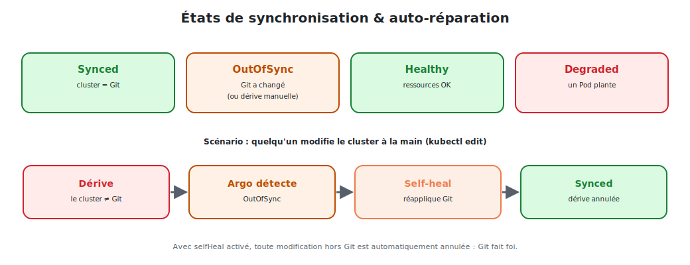

# Synchronisation, auto-réparation & rollback

Le cœur opérationnel d'Argo CD : comment il **synchronise** le cluster avec Git, **corrige**
les dérives et permet de **revenir en arrière**.



<p class="caption">Une dérive manuelle est détectée (OutOfSync) puis annulée automatiquement (selfHeal) : Git fait foi.</p>

## 1. Les états de synchronisation

| État | Signification |
|------|---------------|
| **Synced** | le cluster correspond **exactement** à Git |
| **OutOfSync** | un écart existe (Git a changé, ou le cluster a dérivé) |

Argo CD recalcule cet état **en continu** (par défaut toutes les ~3 min, ou immédiatement
via un **webhook** Git).

## 2. Sync manuelle vs automatique

### Synchronisation manuelle

Sans politique automatique, Argo CD **détecte** les écarts mais **n'applique pas** seul : un
humain (ou la CI) déclenche la synchro.

```bash
argocd app sync nginx          # appliquer maintenant l'état de Git
```

→ pratique pour la **production**, où l'on veut **valider** avant de déployer.

### Synchronisation automatique

```yaml
syncPolicy:
  automated:
    prune: true
    selfHeal: true
```

→ Argo CD applique **automatiquement** dès que Git change. Idéal pour `dev`/`staging`.

## 3. `prune` : supprimer ce qui disparaît de Git

Par défaut, Argo CD **n'efface pas** un objet retiré de Git (par prudence). Avec
`prune: true`, supprimer un fichier du dépôt **supprime** l'objet correspondant dans le
cluster.

> **Exemple :** vous retirez `ingress.yaml` du dossier `apps/nginx`. Avec `prune`, l'Ingress
> est supprimé du cluster à la prochaine synchro. Sans `prune`, il resterait orphelin.

## 4. `selfHeal` : annuler les dérives manuelles

C'est la fonctionnalité la plus spectaculaire. Avec `selfHeal: true`, **toute** modification
faite directement sur le cluster est **annulée** : Argo CD réapplique Git.

```bash
# Quelqu'un bricole le cluster à la main…
kubectl scale deployment nginx --replicas=10 -n prod

# …Argo CD le voit (OutOfSync), et puisque Git dit 3, il revient à 3.
# La dérive est annulée. Pour passer à 10, il FAUT modifier Git.
```

> **`selfHeal` rend le cluster immuable depuis l'extérieur de Git.** C'est la garantie
> ultime contre la dérive : le seul moyen de changer quelque chose, c'est un commit.

## 5. Les hooks de synchronisation

Argo CD sait exécuter des actions **autour** d'une synchro (migrations de base, tests…)
grâce à des **annotations** sur des ressources (souvent des Jobs) :

| Hook | Quand |
|------|-------|
| `PreSync` | **avant** d'appliquer (ex. migration de schéma) |
| `Sync` | **pendant** la synchro |
| `PostSync` | **après** (ex. tests de fumée, notification) |
| `SyncFail` | si la synchro **échoue** |

```yaml
metadata:
  annotations:
    argocd.argoproj.io/hook: PreSync
```

## 6. Le rollback : revenir à une version précédente

Tout l'historique des synchros est conservé. Deux façons de revenir en arrière.

### La façon GitOps (recommandée)

```bash
git revert <commit-fautif>
git push
# → Argo CD re-synchronise vers l'état d'avant. L'historique reste propre et auditable.
```

### La façon Argo CD (dépannage rapide)

```bash
argocd app history nginx              # lister les déploiements passés
argocd app rollback nginx 42          # revenir à la révision applicative 42
```

> **Préférez `git revert`** : il garde Git comme **seule** source de vérité. Un
> `argocd rollback` met temporairement le cluster en avance sur Git (donc **OutOfSync**) ;
> à n'utiliser qu'en urgence, en réalignant Git ensuite.

## 7. Déclencher la synchro instantanément (webhook)

Plutôt que d'attendre le prochain cycle, on configure un **webhook** Git (GitHub, GitLab…)
qui prévient Argo CD à chaque push :

```
Dépôt Git ▸ Settings ▸ Webhooks ▸  https://argocd.exemple.com/api/webhook
```

→ le déploiement devient **quasi instantané** après le `git push`.

## 8. Récapitulatif des comportements

| Politique | Effet |
|-----------|-------|
| `automated` | applique automatiquement les changements de Git |
| `prune: true` | supprime les objets retirés de Git |
| `selfHeal: true` | annule les modifications faites hors Git |
| webhook | synchronise dès le `git push` (sinon ~3 min) |

> **À retenir :** `Synced`/`OutOfSync` mesurent l'écart avec Git ; `automated`, `prune` et
> `selfHeal` automatisent l'alignement ; le rollback se fait idéalement par `git revert`.
> Git reste, en toutes circonstances, **la** vérité.
