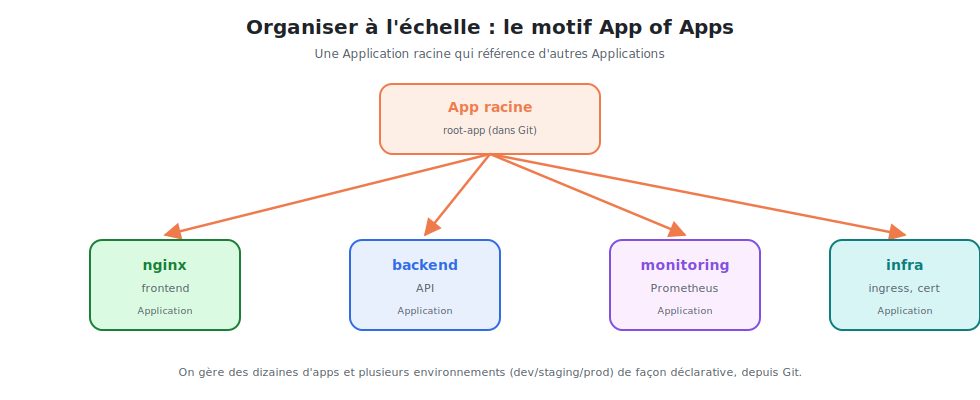

# Structurer le dépôt & gérer les environnements

À l'échelle, on gère **plusieurs applications** et **plusieurs environnements**
(dev/staging/prod). L'organisation du dépôt Git et le motif **App of Apps** rendent cela
maintenable.



<p class="caption">Une Application racine référence d'autres Applications : on gère des dizaines d'apps depuis Git.</p>

## 1. Organiser le dépôt de configuration

Une structure claire et lisible, par application et par environnement :

```
quickbite-config/
├── apps/
│   ├── nginx/
│   │   ├── base/                # commun à tous les environnements
│   │   │   ├── deployment.yaml
│   │   │   └── service.yaml
│   │   └── overlays/            # variations par environnement (Kustomize)
│   │       ├── dev/
│   │       ├── staging/
│   │       └── prod/
│   ├── backend/
│   └── monitoring/
└── argocd/
    ├── root-app.yaml            # l'Application racine (App of Apps)
    └── applications/            # une Application par app/env
        ├── nginx-dev.yaml
        ├── nginx-prod.yaml
        └── ...
```

## 2. Gérer les environnements : base + overlays

On **ne duplique pas** les manifestes par environnement. On garde une **base** commune et
des **surcharges** (overlays) qui ne changent que le nécessaire.

```yaml
# apps/nginx/overlays/prod/kustomization.yaml
resources:
  - ../../base
patches:
  - patch: |-
      - op: replace
        path: /spec/replicas
        value: 5                  # prod : 5 réplicas (base : 1)
```

| Environnement | Différences typiques |
|---------------|----------------------|
| **dev** | 1 réplica, image `:latest`, ressources minimales |
| **staging** | proche de la prod, image taguée |
| **prod** | N réplicas, image figée par tag, limites strictes, sync manuelle |

> Avec **Helm**, le même principe s'applique : un chart, un fichier `values-<env>.yaml` par
> environnement. Argo CD pointe le bon fichier de values dans chaque Application.

## 3. Le motif App of Apps

Créer chaque Application à la main ne passe pas à l'échelle. Le motif **App of Apps** :
**une** Application **racine** qui déploie… **d'autres** Applications.

```yaml
# argocd/root-app.yaml — l'Application racine
apiVersion: argoproj.io/v1alpha1
kind: Application
metadata:
  name: root
  namespace: argocd
spec:
  project: default
  source:
    repoURL: https://github.com/mon-orga/quickbite-config
    path: argocd/applications        # un dossier PLEIN d'Applications
    targetRevision: main
  destination:
    server: https://kubernetes.default.svc
    namespace: argocd
  syncPolicy:
    automated: { prune: true, selfHeal: true }
```

Le dossier `argocd/applications/` contient une Application par app/env. On installe **une
seule fois** la racine ; ensuite, **ajouter une app = ajouter un fichier YAML** dans Git.

```bash
kubectl apply -f argocd/root-app.yaml      # une fois
# → la racine déploie nginx-dev, nginx-prod, backend, monitoring…
```

## 4. ApplicationSet : générer des Applications

Pour des cas très répétitifs (la **même** app sur N environnements ou N clusters), Argo CD
propose l'**ApplicationSet** : il **génère** les Applications à partir d'un patron.

```yaml
apiVersion: argoproj.io/v1alpha1
kind: ApplicationSet
metadata:
  name: nginx
  namespace: argocd
spec:
  generators:
    - list:
        elements:
          - env: dev
          - env: staging
          - env: prod
  template:
    metadata:
      name: 'nginx-{{env}}'
    spec:
      source:
        repoURL: https://github.com/mon-orga/quickbite-config
        path: 'apps/nginx/overlays/{{env}}'
        targetRevision: main
      destination:
        server: https://kubernetes.default.svc
        namespace: '{{env}}'
      syncPolicy:
        automated: { prune: true, selfHeal: true }
```

→ une seule définition crée **nginx-dev, nginx-staging et nginx-prod**. Ajouter un
environnement = ajouter une ligne.

## 5. Promouvoir une version d'un environnement à l'autre

En GitOps, **promouvoir** = un changement dans Git :

1. La CI déploie l'image `nginx:1.28` et met à jour `overlays/dev` → Argo déploie en dev.
2. Une fois validé, on **reporte** le tag `1.28` dans `overlays/staging` (PR) → staging.
3. Puis dans `overlays/prod` (PR avec revue) → prod.

> Chaque promotion est une **Pull Request** : revue, traçabilité, et rollback par
> `git revert`. La « pipeline de promotion » vit entièrement dans Git.

## 6. Bonnes pratiques de structure

- **Séparer** le dépôt applicatif (code) du dépôt de config (manifestes).
- **Une base + des overlays** (ou un chart + des values) — jamais de copier-coller par env.
- **App of Apps** ou **ApplicationSet** pour ne pas créer les Applications à la main.
- **Sync manuelle en prod**, automatique en dev/staging.
- **Tag d'image figé** en prod (pas `latest`) pour des déploiements déterministes.

> **À retenir :** un dépôt bien rangé (base/overlays), le motif **App of Apps** (ou
> **ApplicationSet**) et la promotion par Pull Request permettent de gérer des dizaines
> d'applications sur plusieurs environnements — **tout depuis Git**.
