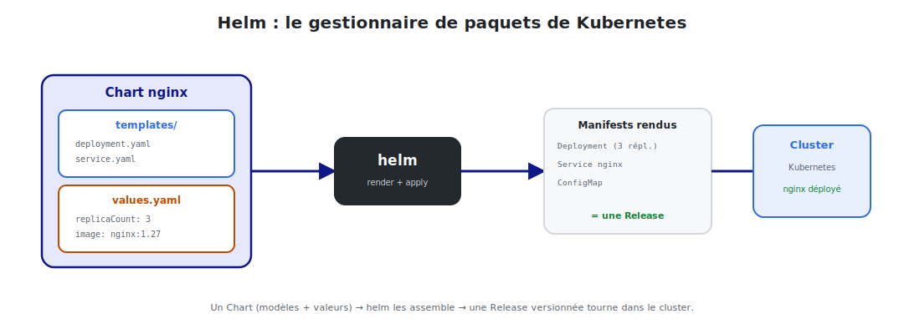

# Introduction : pourquoi Helm ?

## 1. Le problème : des YAML partout

Déployer une application sur Kubernetes, c'est écrire beaucoup de manifestes : Deployment,
Service, ConfigMap, Secret, Ingress… Très vite, plusieurs douleurs apparaissent :

- **La duplication** : on copie-colle les mêmes fichiers pour `dev`, `staging`, `prod`,
  en changeant juste deux ou trois valeurs (nombre de réplicas, image, domaine).
- **Pas de paramétrage** : changer le tag de l'image impose d'éditer le YAML à la main.
- **Pas de versionnement applicatif** : impossible de dire « installe la v1.2 de mon appli »
  ou « reviens à la version précédente » d'un coup.
- **Pas de cycle de vie** : installer, mettre à jour, désinstaller un ensemble cohérent
  d'objets relève du bricolage avec `kubectl apply` / `delete`.

> En clair : `kubectl` sait appliquer des fichiers, mais ne sait pas **packager**,
> **paramétrer** ni **versionner** une application. Il manque un gestionnaire de paquets.

## 2. La solution : Helm

> **Helm** est le **gestionnaire de paquets de Kubernetes** (l'équivalent d'`apt` ou `npm`,
> mais pour des applications K8s). Il empaquette tous les manifestes dans un **chart**
> paramétrable, l'installe en tant que **release** versionnée, et gère son cycle de vie.



<p class="caption">Un Chart (modèles + valeurs) → helm les assemble → une Release versionnée tourne dans le cluster.</p>

## 3. Les trois mots du vocabulaire Helm

| Terme | Définition | Analogie (npm) |
|-------|-----------|----------------|
| **Chart** | Un paquet : modèles de manifestes + valeurs par défaut | le `package` |
| **Release** | Une **instance installée** d'un chart dans le cluster | l'appli installée |
| **Repository** | Un dépôt d'où l'on télécharge des charts | le registre npm |

Un même chart peut donner **plusieurs releases** (ex. : `nginx-dev` et `nginx-prod`,
chacune avec ses propres valeurs).

## 4. Ce que Helm apporte concrètement

| Sans Helm (`kubectl`) | Avec Helm |
|-----------------------|-----------|
| Copier-coller des YAML par environnement | **Un** chart + des fichiers de valeurs |
| Éditer le YAML pour changer une valeur | `--set image.tag=1.28` |
| Suivi des versions « à la main » | `helm history`, **révisions** automatiques |
| Rollback manuel et risqué | `helm rollback` en une commande |
| Installer 50 objets un par un | `helm install` déploie tout d'un coup |
| Réutiliser le travail des autres | `helm install bitnami/nginx` depuis un repo |

## 5. Notre fil rouge : un chart nginx

Comme pour le cours Kubernetes, on illustre **chaque concept** avec **nginx**. On va :

1. comprendre l'**architecture** de Helm (chart, release, repo) ;
2. créer un chart nginx et explorer sa **structure** ;
3. **templatiser** les manifestes avec des valeurs (`values.yaml`) ;
4. installer, **mettre à jour** et faire un **rollback** d'une release ;
5. gérer les **dépendances** et les **repositories** ;
6. appliquer les **bonnes pratiques** (lint, dry-run, packaging).

## 6. Installer Helm

```bash
# Linux (script officiel)
curl https://raw.githubusercontent.com/helm/helm/main/scripts/get-helm-3 | bash

# Vérifier
helm version          # v3.x

# Helm utilise le contexte kubectl courant
kubectl config current-context
```

> **Helm 3** (la version actuelle) n'a **plus** de composant serveur (« Tiller ») : c'est
> un simple binaire côté client qui parle à l'API Kubernetes. Plus simple et plus sûr que
> Helm 2.

Premier essai pour se faire une idée :

```bash
helm create demo          # génère un chart d'exemple complet
ls demo/                  # Chart.yaml  values.yaml  templates/  charts/
```

Dans le module suivant, on décortique ces concepts un par un.
