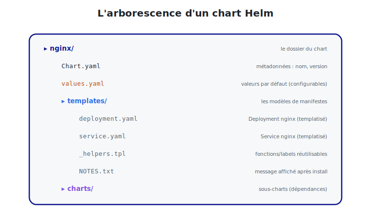

# La structure d'un chart

Un chart est avant tout une **arborescence de fichiers** bien définie. Helm sait exactement
où chercher chaque chose.



<p class="caption">Chart.yaml (métadonnées), values.yaml (valeurs), templates/ (modèles), charts/ (dépendances).</p>

## 1. L'arborescence générée par `helm create`

```bash
helm create nginx
```

```
nginx/
├── Chart.yaml          # métadonnées du chart
├── values.yaml         # valeurs par défaut (configurables)
├── templates/          # les modèles de manifestes
│   ├── deployment.yaml
│   ├── service.yaml
│   ├── _helpers.tpl    # fonctions/labels réutilisables
│   ├── NOTES.txt       # message affiché après l'install
│   └── ...
└── charts/             # sous-charts (dépendances)
```

## 2. `Chart.yaml` — la carte d'identité

```yaml
apiVersion: v2              # v2 = Helm 3
name: nginx                 # nom du chart
description: Un chart pour déployer nginx
type: application           # "application" ou "library"
version: 1.0.0              # version DU CHART (SemVer)
appVersion: "1.27"          # version de l'APPLICATION packagée (nginx)
```

> **Deux versions à ne pas confondre :**
> - `version` : la version **du chart** (de l'emballage). On l'incrémente à chaque
>   modification du chart.
> - `appVersion` : la version de **l'application** embarquée (ici nginx 1.27). Purement
>   informative.

## 3. `values.yaml` — les valeurs par défaut

C'est **le** fichier de configuration. Il définit toutes les valeurs paramétrables et
leurs **défauts**. L'utilisateur les surcharge à l'installation.

```yaml
replicaCount: 3

image:
  repository: nginx
  tag: "1.27"
  pullPolicy: IfNotPresent

service:
  type: ClusterIP
  port: 80

resources:
  requests:
    cpu: 100m
    memory: 64Mi
```

Toute valeur ici est accessible dans les templates via `{{ .Values.xxx }}`. Par exemple
`{{ .Values.replicaCount }}` ou `{{ .Values.image.tag }}`.

## 4. `templates/` — les modèles

Ce dossier contient les manifestes Kubernetes, mais **templatisés** : ils contiennent des
expressions `{{ ... }}` qui seront remplacées par les valeurs au moment de l'install.

`templates/deployment.yaml` (extrait) :

```yaml
apiVersion: apps/v1
kind: Deployment
metadata:
  name: {{ .Release.Name }}-nginx
spec:
  replicas: {{ .Values.replicaCount }}
  template:
    spec:
      containers:
        - name: nginx
          image: "{{ .Values.image.repository }}:{{ .Values.image.tag }}"
          ports:
            - containerPort: {{ .Values.service.port }}
```

## 5. `_helpers.tpl` — les fonctions réutilisables

Les fichiers commençant par `_` ne génèrent **pas** de manifeste : ils définissent des
**morceaux réutilisables** (nommage, labels communs). Exemple :

```
{{- define "nginx.labels" -}}
app.kubernetes.io/name: {{ .Chart.Name }}
app.kubernetes.io/instance: {{ .Release.Name }}
{{- end -}}
```

On les inclut ensuite dans les templates avec `{{ include "nginx.labels" . }}` — pour ne
pas répéter les mêmes labels dans chaque fichier.

## 6. `NOTES.txt` — le message d'accueil

Affiché **après** `helm install`, c'est un mode d'emploi rapide pour l'utilisateur (souvent
généré dynamiquement). Exemple : « Votre nginx est accessible via… ».

## 7. Les objets de contexte intégrés

Dans les templates, Helm fournit des objets prêts à l'emploi :

| Objet | Contenu | Exemple |
|-------|---------|---------|
| `.Values` | les valeurs de `values.yaml` (+ surcharges) | `.Values.replicaCount` |
| `.Release` | infos sur la release | `.Release.Name`, `.Release.Namespace` |
| `.Chart` | infos de `Chart.yaml` | `.Chart.Name`, `.Chart.Version` |
| `.Files` | accès aux fichiers du chart | `.Files.Get "config.txt"` |
| `.Capabilities` | capacités du cluster | versions d'API disponibles |

## 8. Vérifier la structure

```bash
helm lint nginx              # erreurs/avertissements de structure
helm show chart nginx        # afficher Chart.yaml
helm show values nginx       # afficher les valeurs par défaut
```

> **À retenir :** un chart, c'est `Chart.yaml` (qui), `values.yaml` (quoi configurer) et
> `templates/` (comment générer les manifestes). Le module suivant montre le cœur du
> sujet : le **templating**.
