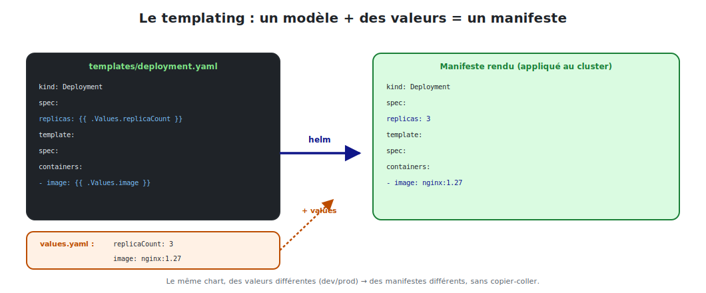

# Templates & values : le cœur de Helm

C'est la puissance de Helm : **un seul** modèle, paramétré par des **valeurs**, génère des
manifestes différents selon l'environnement — **sans copier-coller**.



<p class="caption">Le même chart, des valeurs différentes (dev/prod) → des manifestes différents.</p>

## 1. La syntaxe de base : `{{ ... }}`

Helm utilise le moteur de **templates Go**. Tout ce qui est entre `{{ }}` est **évalué**
puis remplacé.

```yaml
spec:
  replicas: {{ .Values.replicaCount }}
  # si values.yaml contient replicaCount: 3  →  replicas: 3
```

## 2. Injecter des valeurs

```yaml
image: "{{ .Values.image.repository }}:{{ .Values.image.tag }}"
# → image: "nginx:1.27"

metadata:
  name: {{ .Release.Name }}-nginx
  # → name: nginx-prod-nginx  (si la release s'appelle "nginx-prod")
```

## 3. Surcharger les valeurs à l'installation

Trois façons de fournir des valeurs, par ordre de priorité croissante :

```bash
# 1) valeurs par défaut du chart (values.yaml)        — priorité basse
helm install nginx-prod ./nginx

# 2) un fichier de valeurs spécifique
helm install nginx-prod ./nginx -f values-prod.yaml

# 3) en ligne de commande (--set)                     — priorité haute
helm install nginx-prod ./nginx --set replicaCount=5 --set image.tag=1.28
```

> **Le multi-environnement, le vrai intérêt :** on garde **un** chart et on a des fichiers
> `values-dev.yaml`, `values-staging.yaml`, `values-prod.yaml`. Seules les valeurs changent.

```yaml
# values-prod.yaml
replicaCount: 5
image:
  tag: "1.28"
resources:
  limits:
    cpu: 500m
    memory: 256Mi
```

## 4. Les conditions

On inclut/exclut un bloc selon une valeur :

```yaml
{{- if .Values.ingress.enabled }}
apiVersion: networking.k8s.io/v1
kind: Ingress
metadata:
  name: {{ .Release.Name }}-nginx
# ...
{{- end }}
```

→ l'Ingress n'est généré **que si** `ingress.enabled: true`. Pratique pour activer une
fonctionnalité selon l'environnement.

## 5. Les boucles

Pour générer une liste (variables d'env, ports, hosts…) :

```yaml
env:
{{- range .Values.extraEnv }}
  - name: {{ .name }}
    value: {{ .value | quote }}
{{- end }}
```

```yaml
# values.yaml
extraEnv:
  - name: ENV
    value: production
  - name: LOG_LEVEL
    value: warn
```

## 6. Les fonctions et les « pipes »

Le caractère `|` enchaîne des **fonctions** (comme un pipe shell) :

| Expression | Résultat |
|-----------|----------|
| `{{ .Values.name | upper }}` | met en MAJUSCULES |
| `{{ .Values.name | default "nginx" }}` | valeur par défaut si vide |
| `{{ .Values.tag | quote }}` | entoure de guillemets |
| `{{ .Values.port | int }}` | force le type entier |
| `{{ include "nginx.labels" . | indent 4 }}` | inclut + indente |

```yaml
tag: {{ .Values.image.tag | default "1.27" | quote }}
# → tag: "1.27"
```

## 7. Les valeurs imbriquées avec `with`

`with` change le contexte courant pour alléger l'écriture :

```yaml
{{- with .Values.resources }}
resources:
  requests:
    cpu: {{ .requests.cpu }}
    memory: {{ .requests.memory }}
{{- end }}
```

## 8. Déboguer le rendu sans rien installer

**La commande la plus utile** quand on développe un chart :

```bash
helm template nginx-prod ./nginx                     # rend tous les manifestes
helm template nginx-prod ./nginx -f values-prod.yaml # avec des valeurs précises
helm install nginx-prod ./nginx --dry-run --debug    # simulation complète
```

`helm template` affiche le YAML **final** (valeurs remplacées) **sans toucher au cluster** :
on voit immédiatement ce qui serait appliqué.

> **À retenir :** `{{ .Values.x }}` pour injecter, `if`/`range` pour la logique, `|` pour
> transformer, et `helm template` pour vérifier. C'est tout l'art du chart : un modèle
> générique, des valeurs spécifiques.
