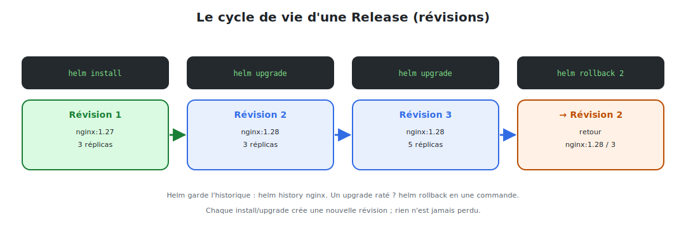

# Releases : installer, mettre à jour, rollback

Une fois le chart prêt, on entre dans le **cycle de vie** : installer une release, la
mettre à jour, et — point fort de Helm — **revenir en arrière** en cas de problème.



<p class="caption">Chaque install/upgrade crée une révision ; helm rollback revient à n'importe laquelle.</p>

## 1. Installer une release

```bash
helm install nginx-prod ./nginx
```

- `nginx-prod` : le **nom de la release** (libre, unique dans le namespace).
- `./nginx` : le chart (dossier local, ou `repo/chart`, ou archive `.tgz`).

```bash
helm install nginx-prod ./nginx \
  --namespace prod --create-namespace \
  -f values-prod.yaml
```

Vérifier :

```bash
helm list -n prod
kubectl get all -n prod        # les objets créés par la release
```

## 2. Mettre à jour une release

On modifie le chart ou les valeurs, puis :

```bash
helm upgrade nginx-prod ./nginx --set image.tag=1.28
```

Chaque `upgrade` crée une **nouvelle révision**. Helm calcule la différence et applique le
changement (en s'appuyant sur le rolling update des Deployments → **sans coupure**).

```bash
# Pratique : installer si absent, sinon mettre à jour
helm upgrade --install nginx-prod ./nginx -f values-prod.yaml
```

> **`upgrade --install`** est le réflexe en CI/CD : la commande est **idempotente** — elle
> installe la première fois, met à jour les fois suivantes.

## 3. L'historique des révisions

Helm **mémorise** chaque révision d'une release.

```bash
helm history nginx-prod
```

```
REVISION  STATUS      CHART        APP VERSION  DESCRIPTION
1         superseded  nginx-1.0.0  1.27         Install complete
2         superseded  nginx-1.0.0  1.28         Upgrade complete
3         deployed    nginx-1.0.0  1.28         Upgrade complete
```

## 4. Le rollback : revenir en arrière

La nouvelle version est cassée ? On revient à une révision précédente **en une commande**,
sans reconstruire ni réécrire quoi que ce soit :

```bash
helm rollback nginx-prod            # revient à la révision précédente
helm rollback nginx-prod 1          # revient à la révision 1 précise
```

Le rollback crée lui-même une **nouvelle révision** (l'historique n'est jamais réécrit) :

```
4         deployed    nginx-1.0.0  1.27   Rollback to 1
```

> **C'est le filet de sécurité de Helm.** Un déploiement raté en production se corrige en
> quelques secondes. C'est ce qui rend les déploiements fréquents sereins.

## 5. Inspecter une release

```bash
helm status nginx-prod                       # état + NOTES.txt
helm get values nginx-prod                   # valeurs effectivement utilisées
helm get manifest nginx-prod                 # YAML réellement appliqué
helm get values nginx-prod --revision 2      # valeurs d'une révision passée
```

## 6. Désinstaller

```bash
helm uninstall nginx-prod                     # supprime TOUS les objets de la release
helm uninstall nginx-prod --keep-history      # garde l'historique (rollback possible)
```

Un seul `uninstall` retire proprement l'ensemble (Deployment, Service, ConfigMap…) — pas
besoin de supprimer les objets un par un.

## 7. Options utiles de cycle de vie

| Option | Effet |
|--------|-------|
| `--dry-run` | simule sans appliquer |
| `--atomic` | en cas d'échec d'upgrade, **rollback automatique** |
| `--wait` | attend que les ressources soient prêtes avant de rendre la main |
| `--timeout 5m` | délai d'attente max |
| `--namespace` / `--create-namespace` | cibler/créer un namespace |

```bash
# Déploiement « tout ou rien » : si ça échoue, on revient à l'état d'avant
helm upgrade --install nginx-prod ./nginx --atomic --wait --timeout 5m
```

> **À retenir :** `install` → `upgrade` → (`rollback` si besoin) → `uninstall`. Chaque
> étape est tracée en révisions. Avec `--atomic --wait`, un upgrade raté se répare **tout
> seul**. C'est la gestion de cycle de vie qui manquait à `kubectl`.
