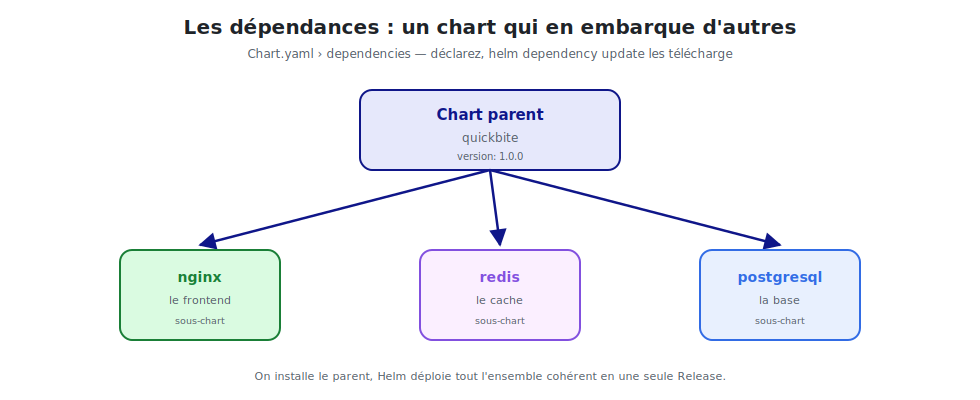

# Dépendances & repositories

Une application réelle se compose souvent de **plusieurs briques** : le frontend nginx, un
cache Redis, une base de données… Helm permet de les **assembler** via les dépendances, et
de **réutiliser** des charts publics via les repositories.



<p class="caption">Un chart parent déclare des sous-charts ; on installe le tout en une seule Release.</p>

## 1. Les repositories : réutiliser des charts existants

Avant d'écrire un chart, vérifiez s'il existe déjà. Les repositories publics regorgent de
charts maintenus et éprouvés.

```bash
# Ajouter des repositories
helm repo add bitnami https://charts.bitnami.com/bitnami
helm repo add ingress-nginx https://kubernetes.github.io/ingress-nginx
helm repo update                       # rafraîchir les index

# Lister / chercher
helm repo list
helm search repo nginx
helm search hub wordpress              # chercher sur l'Artifact Hub (tous repos)
```

Installer un chart public directement :

```bash
helm install mon-nginx bitnami/nginx --set replicaCount=3
```

> **Artifact Hub** (artifacthub.io) est l'annuaire central des charts publics. On y trouve
> presque toutes les briques courantes : bases de données, monitoring, ingress, etc.

## 2. Inspecter un chart distant avant de l'installer

```bash
helm show chart bitnami/nginx          # métadonnées
helm show values bitnami/nginx         # toutes les valeurs configurables
helm pull bitnami/nginx --untar        # télécharger et décompresser pour l'étudier
```

## 3. Déclarer des dépendances

Un chart peut **dépendre** d'autres charts (ses **sous-charts**). On les déclare dans
`Chart.yaml` :

```yaml
# Chart.yaml du chart parent "quickbite"
apiVersion: v2
name: quickbite
version: 1.0.0
dependencies:
  - name: nginx
    version: "15.x.x"
    repository: https://charts.bitnami.com/bitnami
  - name: redis
    version: "18.x.x"
    repository: https://charts.bitnami.com/bitnami
    condition: redis.enabled        # activable/désactivable
```

Télécharger les dépendances dans `charts/` :

```bash
helm dependency update quickbite      # remplit charts/ et écrit Chart.lock
helm dependency list quickbite        # état des dépendances
```

## 4. Configurer les sous-charts depuis le parent

Les valeurs d'un sous-chart se surchargent **sous une clé portant son nom**, dans le
`values.yaml` du parent :

```yaml
# values.yaml du parent
nginx:                    # ← valeurs passées au sous-chart "nginx"
  replicaCount: 3
  image:
    tag: "1.27"

redis:                    # ← valeurs passées au sous-chart "redis"
  enabled: true
  auth:
    enabled: false
```

Puis une seule commande déploie **tout l'ensemble** de façon cohérente :

```bash
helm install quickbite ./quickbite
# → installe nginx + redis (+ le parent) en UNE release
```

## 5. Le verrouillage des versions : `Chart.lock`

`helm dependency update` génère un `Chart.lock` qui **fige** les versions exactes
téléchargées (comme `package-lock.json`). On le **committe** pour des installations
**reproductibles**.

```bash
helm dependency build quickbite       # réinstalle EXACTEMENT les versions du Chart.lock
```

## 6. Packager et publier son propre chart

```bash
helm package nginx                     # crée nginx-1.0.0.tgz
helm lint nginx                        # valider avant publication
```

On peut ensuite héberger l'archive et un `index.yaml` sur :

- un serveur HTTP statique (GitHub Pages, S3…) ;
- un **registry OCI** (Docker Hub, GHCR, Harbor…), désormais standard :

```bash
helm push nginx-1.0.0.tgz oci://ghcr.io/mon-orga/charts
helm install nginx-prod oci://ghcr.io/mon-orga/charts/nginx --version 1.0.0
```

> **OCI :** Helm 3 sait stocker les charts dans les **mêmes registries que les images
> Docker**. Un seul endroit (GHCR, Harbor…) pour vos images **et** vos charts.

## 7. Récapitulatif des commandes

```bash
helm repo add / update / list / search
helm show chart|values <repo>/<chart>
helm dependency update|build|list <chart>
helm pull <repo>/<chart> --untar
helm package <chart>
helm push <chart>.tgz oci://<registry>
```

> **À retenir :** ne réinventez pas la roue. Réutilisez des charts publics (repositories),
> assemblez vos briques en sous-charts (dépendances), figez les versions (`Chart.lock`) et
> publiez vos charts comme des artefacts (OCI).
