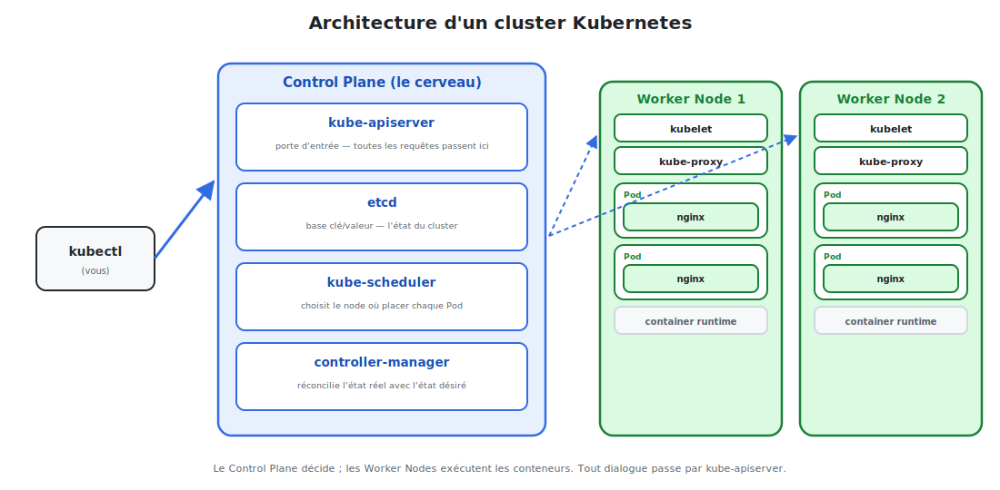

# L'architecture d'un cluster Kubernetes

Un **cluster** Kubernetes est un ensemble de machines (des *nodes*) qui travaillent
ensemble. Elles se répartissent en deux rôles : **piloter** et **exécuter**.



<p class="caption">Le Control Plane décide ; les Worker Nodes exécutent les conteneurs. Tout dialogue passe par kube-apiserver.</p>

## 1. Les deux mondes : Control Plane & Worker Nodes

| | **Control Plane** | **Worker Nodes** |
|---|-------------------|------------------|
| Rôle | Le **cerveau** : décide et surveille | Les **bras** : font tourner les Pods |
| Contient | apiserver, etcd, scheduler, controllers | kubelet, kube-proxy, runtime, Pods |
| Analogie | La tour de contrôle | Les pistes et les avions |

## 2. Les composants du Control Plane

### kube-apiserver — la porte d'entrée

**Tout** passe par lui : `kubectl`, les autres composants, les outils. C'est l'unique
point d'accès au cluster, qui valide et enregistre chaque requête. Quand vous tapez
`kubectl apply`, vous parlez à l'apiserver.

### etcd — la mémoire du cluster

Une base de données **clé/valeur** qui stocke **tout l'état** du cluster : quels objets
existent, leur configuration, leur état désiré. Si etcd est perdu, le cluster est perdu —
d'où l'importance de le **sauvegarder**.

### kube-scheduler — le placeur

Quand un nouveau Pod doit tourner, le scheduler choisit **sur quel node** le placer, selon
les ressources disponibles (CPU, mémoire), les contraintes et les affinités.

### controller-manager — le gardien de l'état désiré

Il fait tourner les **boucles de réconciliation**. Exemple : le *ReplicaSet controller*
vérifie en continu « y a-t-il bien 3 nginx ? ». S'il en manque un, il en commande un nouveau.

## 3. Les composants d'un Worker Node

### kubelet — l'agent du node

Sur chaque worker, le kubelet reçoit les ordres de l'apiserver et **fait tourner les
conteneurs** via le runtime. Il rapporte aussi l'état des Pods (vivants ? en bonne santé ?).

### kube-proxy — le routeur réseau

Gère les règles réseau du node pour que les **Services** fonctionnent : il route le trafic
vers le bon Pod, où qu'il soit.

### container runtime — le moteur de conteneurs

Le logiciel qui exécute réellement les conteneurs (containerd, CRI-O…). C'est lui qui
télécharge l'image `nginx` et lance le processus.

## 4. Le cycle de vie d'une demande

Quand vous lancez `kubectl apply -f nginx.yaml` pour créer 3 nginx :

1. **kubectl** envoie le YAML à **kube-apiserver**.
2. L'apiserver valide et écrit l'état désiré dans **etcd**.
3. Le **controller-manager** voit « 3 Pods voulus, 0 existant » → crée 3 Pods.
4. Le **scheduler** assigne chaque Pod à un **node**.
5. Le **kubelet** du node concerné demande au **runtime** de lancer le conteneur nginx.
6. **kube-proxy** met en place le routage réseau.

> **Le principe à retenir :** personne ne « lance » directement un conteneur. On déclare
> un état dans etcd, et les **contrôleurs** convergent vers cet état. C'est ce qui rend
> Kubernetes auto-réparateur.

## 5. Quelques commandes pour explorer le cluster

```bash
kubectl get nodes                 # lister les machines du cluster
kubectl get nodes -o wide         # avec IP, OS, version
kubectl cluster-info              # adresses du control plane
kubectl get pods -A               # tous les Pods, tous les namespaces
kubectl describe node <nom>       # détail d'un node (ressources, Pods)
```

Dans la suite, on ne touchera plus directement à ces composants : on travaillera avec des
**objets** (Pods, Deployments, Services…) que les composants se chargent de réaliser.
