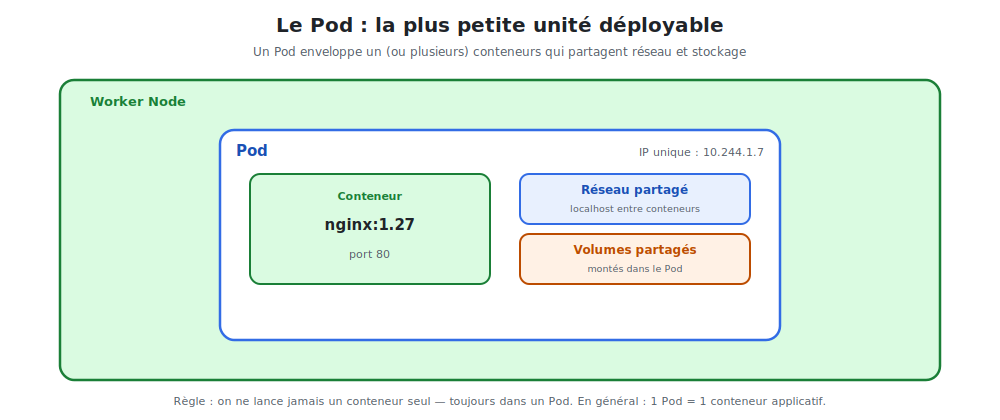

# Les Pods : la plus petite unité

Le **Pod** est l'objet fondamental de Kubernetes. On ne déploie jamais un conteneur
directement : on déploie un **Pod** qui **enveloppe** le conteneur.



<p class="caption">Un Pod enveloppe un (ou plusieurs) conteneurs qui partagent une IP et des volumes.</p>

## 1. Qu'est-ce qu'un Pod ?

- C'est une **enveloppe** autour d'un ou plusieurs conteneurs.
- Les conteneurs d'un même Pod partagent **la même IP** et **les mêmes volumes**, et
  communiquent via `localhost`.
- Un Pod tourne **toujours entièrement sur un seul node**.
- Un Pod est **éphémère** : on ne le répare pas, on le **remplace**. Il reçoit une nouvelle
  IP à chaque recréation.

> **En pratique : 1 Pod = 1 conteneur applicatif.** Le cas multi-conteneurs existe (motif
> *sidecar* : un conteneur principal + un auxiliaire), mais reste l'exception.

## 2. Mon premier Pod nginx

Deux façons de créer un Pod nginx.

### Méthode rapide (impérative)

```bash
kubectl run nginx --image=nginx:1.27 --port=80
kubectl get pods
```

### Méthode recommandée (déclarative, en YAML)

Fichier `nginx-pod.yaml` :

```yaml
apiVersion: v1
kind: Pod
metadata:
  name: nginx
  labels:
    app: nginx          # une étiquette, essentielle pour les Services
spec:
  containers:
    - name: nginx
      image: nginx:1.27
      ports:
        - containerPort: 80
```

```bash
kubectl apply -f nginx-pod.yaml
```

### Anatomie d'un manifeste

Tous les objets Kubernetes partagent les **quatre mêmes champs** :

| Champ | Rôle |
|-------|------|
| `apiVersion` | Version de l'API de l'objet (`v1`, `apps/v1`…) |
| `kind` | Le type d'objet (`Pod`, `Deployment`, `Service`…) |
| `metadata` | Nom, namespace, **labels** |
| `spec` | L'état désiré — le cœur de la définition |

## 3. Inspecter et déboguer un Pod

```bash
kubectl get pods                     # liste + statut (Running, Pending...)
kubectl get pods -o wide             # + IP du Pod et node
kubectl describe pod nginx           # événements détaillés (très utile au débogage)
kubectl logs nginx                   # logs du conteneur (ici, ceux de nginx)
kubectl exec -it nginx -- bash       # ouvrir un shell DANS le conteneur
kubectl port-forward pod/nginx 8080:80   # accéder à nginx depuis le PC : localhost:8080
```

> **Le réflexe débogage :** un Pod ne démarre pas ? `kubectl describe pod <nom>` montre
> les événements (image introuvable, ressources insuffisantes…). Puis `kubectl logs <nom>`
> pour les erreurs applicatives.

## 4. Le cycle de vie d'un Pod

| Phase | Signification |
|-------|---------------|
| `Pending` | Accepté, mais pas encore lancé (téléchargement de l'image, attente de place) |
| `Running` | Au moins un conteneur tourne |
| `Succeeded` | Tous les conteneurs ont terminé avec succès (tâches ponctuelles) |
| `Failed` | Au moins un conteneur s'est terminé en erreur |
| `CrashLoopBackOff` | Le conteneur plante puis redémarre en boucle → voir les logs |

## 5. La grande limite du Pod « nu »

Si vous supprimez ce Pod, ou si son node tombe, **il disparaît définitivement** :

```bash
kubectl delete pod nginx
kubectl get pods            # plus rien — aucun remplacement automatique
```

C'est voulu : **on n'utilise presque jamais un Pod seul**. On confie leur gestion à un
objet de plus haut niveau qui les **recrée** et les **réplique** : le **Deployment**.
C'est l'objet du module suivant.

> **À retenir :** le Pod est l'unité d'exécution, mais il est jetable. La résilience vient
> des contrôleurs (ReplicaSet, Deployment) qui veillent dessus.
