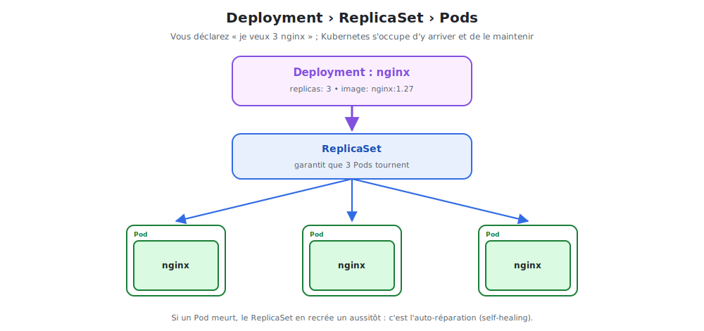

# Deployments & ReplicaSets : la résilience

Un Pod seul est fragile. Le **Deployment** est l'objet qu'on utilise **réellement** pour
faire tourner une application : il garantit un nombre de copies et les répare tout seul.



<p class="caption">Vous déclarez « 3 nginx » ; le Deployment crée un ReplicaSet qui maintient 3 Pods en vie.</p>

## 1. La hiérarchie : Deployment › ReplicaSet › Pods

| Objet | Responsabilité |
|-------|----------------|
| **Deployment** | Gère les **versions** et le **scaling** ; pilote le ReplicaSet |
| **ReplicaSet** | Maintient en permanence **N copies** identiques d'un Pod |
| **Pod** | Exécute le conteneur nginx |

Vous interagissez avec le **Deployment** ; il crée et pilote les ReplicaSets, qui eux-mêmes
créent les Pods. On ne manipule presque jamais le ReplicaSet directement.

## 2. Un Deployment nginx

Fichier `nginx-deployment.yaml` :

```yaml
apiVersion: apps/v1
kind: Deployment
metadata:
  name: nginx
spec:
  replicas: 3                  # ── l'état désiré : 3 Pods
  selector:
    matchLabels:
      app: nginx               # quels Pods ce Deployment gère-t-il ?
  template:                    # ── le « moule » des Pods créés
    metadata:
      labels:
        app: nginx             # doit correspondre au selector ci-dessus
    spec:
      containers:
        - name: nginx
          image: nginx:1.27
          ports:
            - containerPort: 80
```

```bash
kubectl apply -f nginx-deployment.yaml
kubectl get deployments
kubectl get replicasets
kubectl get pods            # → 3 Pods nginx-xxxx
```

> **Le champ `template`** est un mini-manifeste de Pod : c'est le **moule** à partir duquel
> chaque réplica est fabriqué. Le `selector` relie le Deployment aux Pods via leurs **labels**.

## 3. L'auto-réparation (self-healing)

C'est la magie du modèle déclaratif. Supprimez un Pod « à la main » :

```bash
kubectl delete pod nginx-7c5ddbdf54-abcde
kubectl get pods          # un NOUVEAU Pod apparaît aussitôt → toujours 3
```

Le ReplicaSet a constaté « 2 Pods alors qu'il en faut 3 » et en a **recréé un**
immédiatement. Même chose si un node tombe : les Pods sont recréés ailleurs.

## 4. Le scaling : changer le nombre de réplicas

### À la volée

```bash
kubectl scale deployment nginx --replicas=5
kubectl get pods          # → 5 Pods maintenant
```

### Dans le YAML (recommandé, versionné)

On modifie `replicas: 5` puis `kubectl apply -f nginx-deployment.yaml`.

### Scaling automatique (HPA)

Kubernetes peut **adapter le nombre de Pods à la charge CPU** :

```bash
kubectl autoscale deployment nginx --min=2 --max=10 --cpu-percent=70
```

→ entre 2 et 10 Pods selon la charge. C'est le *Horizontal Pod Autoscaler*.

## 5. Pourquoi toujours passer par un Deployment ?

| Sans Deployment (Pod nu) | Avec Deployment |
|--------------------------|-----------------|
| Pod supprimé = perdu | Pod recréé automatiquement |
| Pas de réplication | `replicas: N` |
| Pas de mise à jour propre | Rolling update + rollback (module suivant) |
| Pas de scaling | `kubectl scale` / HPA |

## 6. Commandes utiles

```bash
kubectl get deployment nginx                 # statut : READY 3/3
kubectl describe deployment nginx            # détails, événements, stratégie
kubectl get pods -l app=nginx                # filtrer par label
kubectl delete deployment nginx              # supprime le Deployment ET ses Pods
```

> **À retenir :** le Deployment, c'est l'unité de déploiement standard. Il transforme des
> Pods jetables en service **résilient** et **scalable**. Le module suivant montre comment
> il met à jour nginx **sans aucune coupure**.
