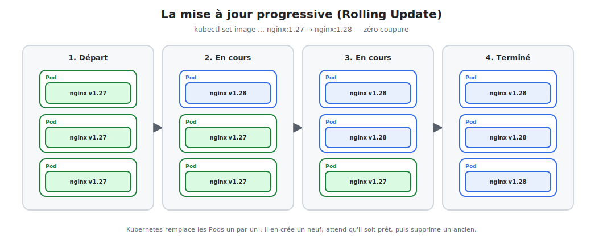

# Mises à jour sans coupure & rollback

Mettre à jour nginx de `1.27` à `1.28` ne doit **jamais** couper le service. Le Deployment
gère cela nativement grâce au **Rolling Update**.



<p class="caption">Kubernetes remplace les Pods un par un : il en crée un neuf, attend qu'il soit prêt, puis supprime un ancien.</p>

## 1. Le principe du Rolling Update

Plutôt que tout arrêter puis tout relancer (coupure), Kubernetes remplace les Pods
**progressivement** :

1. Il crée un Pod en nouvelle version (`1.28`).
2. Il **attend qu'il soit prêt** (voir *readiness probe*, module 09).
3. Il supprime un Pod en ancienne version (`1.27`).
4. Il répète jusqu'à ce que tous les Pods soient à jour.

À tout instant, il reste assez de Pods pour **servir le trafic** : **zéro coupure**.

## 2. Déclencher une mise à jour

### En ligne de commande

```bash
kubectl set image deployment/nginx nginx=nginx:1.28
```

### En YAML (recommandé)

On change `image: nginx:1.27` → `image: nginx:1.28`, puis :

```bash
kubectl apply -f nginx-deployment.yaml
```

### Suivre le déroulement

```bash
kubectl rollout status deployment/nginx     # progression en direct
kubectl get pods -w                         # voir les Pods se remplacer (-w = watch)
```

## 3. Régler la stratégie de déploiement

On contrôle finement le rythme dans le `spec` du Deployment :

```yaml
spec:
  replicas: 4
  strategy:
    type: RollingUpdate
    rollingUpdate:
      maxUnavailable: 1     # au plus 1 Pod indisponible pendant la màj
      maxSurge: 1           # au plus 1 Pod supplémentaire créé temporairement
```

| Paramètre | Effet |
|-----------|-------|
| `maxUnavailable` | Combien de Pods peuvent manquer pendant la màj (capacité minimale) |
| `maxSurge` | Combien de Pods en plus on s'autorise (vitesse de bascule) |

> **Alternative `Recreate` :** `strategy.type: Recreate` supprime tous les anciens Pods
> avant de créer les nouveaux. Il y a une **coupure**, mais c'est parfois nécessaire (ex. :
> incompatibilité entre deux versions qui ne peuvent pas coexister).

## 4. L'historique et le rollback

Kubernetes **mémorise** les versions successives du Deployment.

```bash
kubectl rollout history deployment/nginx        # lister les révisions
kubectl rollout history deployment/nginx --revision=2   # détail d'une révision
```

### Revenir en arrière en cas de problème

La nouvelle version est boguée ? On revient à la précédente **en une commande** :

```bash
kubectl rollout undo deployment/nginx                  # revenir à la version d'avant
kubectl rollout undo deployment/nginx --to-revision=2  # revenir à une révision précise
```

C'est un **filet de sécurité** essentiel : un déploiement raté se corrige en quelques
secondes, sans reconstruire quoi que ce soit.

## 5. Mettre en pause / reprendre

Pour grouper plusieurs changements en un seul déploiement :

```bash
kubectl rollout pause deployment/nginx     # geler les déploiements
# ... plusieurs modifications ...
kubectl rollout resume deployment/nginx    # tout appliquer d'un coup
```

## 6. Bonnes pratiques

- **Tagger précisément les images** (`nginx:1.28`), jamais `latest` en prod : on doit
  savoir exactement quelle version tourne et pouvoir y revenir.
- **Définir une readiness probe** (module 09) : sans elle, Kubernetes croit un Pod « prêt »
  dès qu'il démarre et peut router du trafic vers un nginx pas encore opérationnel.
- **Surveiller `rollout status`** : il échoue si la nouvelle version ne devient jamais
  prête, ce qui évite de remplacer tous les Pods par des Pods cassés.

> **À retenir :** le couple *Rolling Update + rollback* permet de déployer souvent et sans
> stress. Une mauvaise version ? `kubectl rollout undo`, et c'est réglé.
