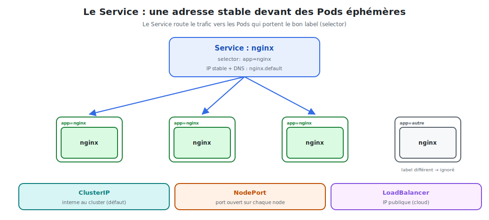

# Les Services : exposer nginx

Les Pods sont **éphémères** et changent d'IP à chaque recréation. Comment leur parler de
façon fiable ? Avec un **Service** : une adresse **stable** devant un groupe de Pods.



<p class="caption">Le Service route le trafic vers les Pods qui portent le bon label (selector).</p>

## 1. Le problème que le Service résout

```bash
kubectl get pods -o wide -l app=nginx
# nginx-aaa  10.244.1.7
# nginx-bbb  10.244.1.8   ← ces IP changent à chaque recréation !
```

On ne peut pas coder en dur l'IP d'un Pod. Le **Service** fournit :

- une **IP virtuelle stable** (ClusterIP) qui ne change jamais ;
- un **nom DNS** (`nginx.default.svc.cluster.local`) ;
- un **load-balancing** automatique entre tous les Pods correspondants.

## 2. Le mécanisme : labels & selector

Le Service ne connaît pas les Pods par leur nom : il les **sélectionne par label**.

```yaml
apiVersion: v1
kind: Service
metadata:
  name: nginx
spec:
  selector:
    app: nginx          # cible TOUS les Pods portant label app=nginx
  ports:
    - port: 80          # port du Service
      targetPort: 80    # port du conteneur nginx
```

> **Le couplage labels ↔ selector est le ciment de Kubernetes.** Tout Pod qui porte
> `app=nginx` est automatiquement intégré au Service — même créé après lui. Aucune
> configuration d'IP, jamais.

## 3. Les trois types de Service

| Type | Portée | Usage typique |
|------|--------|---------------|
| **ClusterIP** (défaut) | interne au cluster | communication entre services |
| **NodePort** | port ouvert sur **chaque node** | accès direct simple, tests |
| **LoadBalancer** | **IP publique** (cloud) | exposer un service sur Internet |

### ClusterIP — le défaut, interne

Accessible **uniquement depuis l'intérieur** du cluster. Les autres Pods joignent nginx
simplement par son nom : `http://nginx`.

### NodePort — un port sur chaque node

```yaml
spec:
  type: NodePort
  selector:
    app: nginx
  ports:
    - port: 80
      targetPort: 80
      nodePort: 30080      # 30000–32767 ; accès via http://<IP-node>:30080
```

### LoadBalancer — une IP publique (cloud)

```yaml
spec:
  type: LoadBalancer
  selector:
    app: nginx
  ports:
    - port: 80
      targetPort: 80
```

Sur un cloud (AWS, GCP, Azure), Kubernetes provisionne un vrai load-balancer avec une **IP
publique**. En local (minikube), on utilise `minikube tunnel`.

## 4. Créer et tester un Service

```bash
kubectl expose deployment nginx --port=80 --target-port=80   # méthode rapide
# ou : kubectl apply -f nginx-service.yaml

kubectl get services                    # voir l'IP et le type
kubectl describe service nginx          # voir les "Endpoints" (IP des Pods ciblés)
```

### Vérifier le load-balancing

```bash
# Depuis un Pod de test, plusieurs appels tombent sur des Pods différents
kubectl run tmp --rm -it --image=busybox -- wget -qO- http://nginx
```

## 5. La découverte de service par DNS

Kubernetes intègre un **DNS interne**. Tout Service est joignable par son nom :

| Depuis… | On joint nginx par… |
|---------|---------------------|
| le même namespace | `nginx` |
| un autre namespace | `nginx.default` |
| nom complet | `nginx.default.svc.cluster.local` |

C'est ainsi qu'un backend joint nginx, ou que nginx joint une API : **par nom**, jamais par IP.

## 6. Service vs Ingress

Un Service de type LoadBalancer = **une IP publique par service**, ce qui devient coûteux.
Pour exposer **plusieurs** services HTTP derrière **une seule** entrée et router par URL,
on utilise l'**Ingress** (module 08).

> **À retenir :** Pods éphémères + Service stable = la combinaison qui rend une application
> joignable de façon fiable. Le Service suit automatiquement les Pods grâce aux labels.
