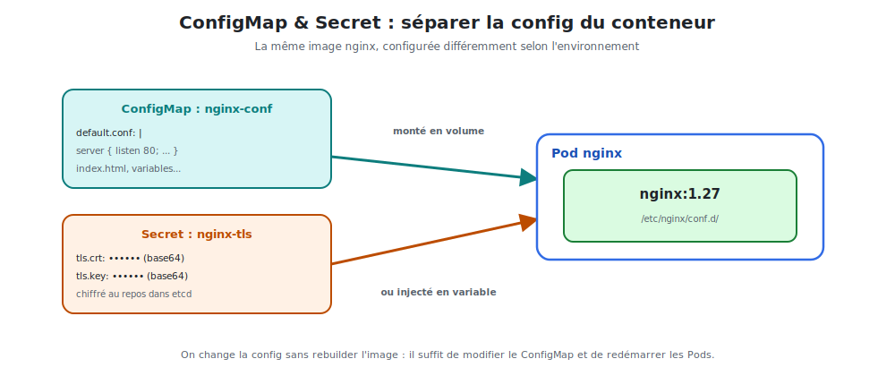

# ConfigMap & Secret : configurer nginx

Une bonne image est **générique** : la même image nginx doit servir en dev, en test et en
prod, avec une **configuration différente** à chaque fois. Kubernetes sépare la config du
conteneur grâce aux **ConfigMaps** et aux **Secrets**.



<p class="caption">La même image nginx, configurée différemment selon l'environnement — sans rebuild.</p>

## 1. Le principe : externaliser la configuration

| Objet | Pour | Stockage |
|-------|------|----------|
| **ConfigMap** | configuration **non sensible** (fichiers conf, variables, URL) | en clair |
| **Secret** | données **sensibles** (mots de passe, clés, certificats TLS) | encodé base64, chiffrable au repos |

> **Pourquoi ?** On ne rebuild **jamais** l'image pour changer un paramètre. On modifie le
> ConfigMap et on redémarre les Pods. La même image `nginx:1.27` tourne partout.

## 2. Un ConfigMap pour la config nginx

### Créer le ConfigMap

```yaml
apiVersion: v1
kind: ConfigMap
metadata:
  name: nginx-conf
data:
  default.conf: |
    server {
      listen 80;
      location / {
        return 200 "Bonjour depuis Kubernetes\n";
      }
    }
```

```bash
kubectl apply -f nginx-conf.yaml
kubectl get configmaps
kubectl describe configmap nginx-conf
```

### Monter le ConfigMap comme fichier dans nginx

On injecte la conf dans `/etc/nginx/conf.d/` via un **volume** :

```yaml
spec:
  containers:
    - name: nginx
      image: nginx:1.27
      volumeMounts:
        - name: conf
          mountPath: /etc/nginx/conf.d        # nginx lit sa conf ici
  volumes:
    - name: conf
      configMap:
        name: nginx-conf
```

Le fichier `default.conf` du ConfigMap apparaît dans le conteneur — **sans rebuild**.

## 3. Injecter des valeurs en variables d'environnement

L'autre usage du ConfigMap : passer des **variables d'environnement**.

```yaml
data:
  ENVIRONMENT: "production"
  WORKER_PROCESSES: "4"
```

```yaml
spec:
  containers:
    - name: nginx
      image: nginx:1.27
      envFrom:
        - configMapRef:
            name: nginx-conf       # toutes les clés deviennent des variables d'env
```

## 4. Les Secrets : pour les données sensibles

Un Secret ressemble à un ConfigMap, mais pour les données **confidentielles**. Les valeurs
sont encodées en **base64**.

```bash
# Créer un Secret TLS depuis des fichiers certificat
kubectl create secret tls nginx-tls --cert=tls.crt --key=tls.key

# Ou un Secret générique
kubectl create secret generic db-pass --from-literal=password='S3cr3t!'
```

En YAML :

```yaml
apiVersion: v1
kind: Secret
metadata:
  name: nginx-tls
type: kubernetes.io/tls
data:
  tls.crt: <contenu-base64>
  tls.key: <contenu-base64>
```

### Utiliser un Secret dans le Pod

```yaml
spec:
  containers:
    - name: nginx
      image: nginx:1.27
      env:
        - name: DB_PASSWORD
          valueFrom:
            secretKeyRef:
              name: db-pass
              key: password
      volumeMounts:
        - name: tls
          mountPath: /etc/nginx/tls           # certificats montés ici
  volumes:
    - name: tls
      secret:
        secretName: nginx-tls
```

## 5. ConfigMap vs Secret : que choisir ?

| Donnée | Objet |
|--------|-------|
| Fichier `nginx.conf`, `index.html` | **ConfigMap** |
| URL d'API publique, niveau de log | **ConfigMap** |
| Mot de passe, token, clé API | **Secret** |
| Certificat / clé TLS | **Secret** (`type: kubernetes.io/tls`) |

> **Attention :** un Secret encodé en base64 **n'est pas chiffré** par défaut — base64 se
> décode trivialement. Pour une vraie protection : activer le *chiffrement au repos* d'etcd,
> restreindre les accès (RBAC), et ne **jamais committer** un Secret en clair dans Git.

## 6. Mettre à jour la configuration

```bash
kubectl edit configmap nginx-conf          # modifier
kubectl rollout restart deployment/nginx   # redémarrer les Pods pour recharger
```

> **À retenir :** image générique + config externalisée = portabilité totale. On déploie
> la **même** image nginx partout, et seuls le ConfigMap et le Secret changent.
