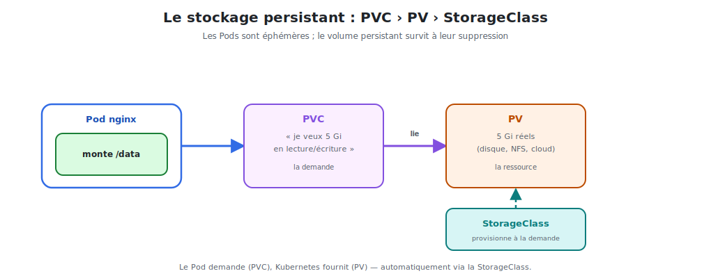

# Le stockage persistant

Les Pods sont **éphémères** : quand un Pod meurt, son disque disparaît avec lui. Pour
conserver des données (logs, uploads, cache), il faut un **volume persistant** qui
**survit** aux Pods.



<p class="caption">Le Pod demande (PVC), Kubernetes fournit (PV) — automatiquement via la StorageClass.</p>

## 1. Volume éphémère vs persistant

| | Volume éphémère (`emptyDir`) | Volume persistant (PV/PVC) |
|---|------------------------------|-----------------------------|
| Durée de vie | celle du Pod | indépendante du Pod |
| Pod supprimé | données perdues | **données conservées** |
| Usage | cache, scratch temporaire | données importantes |

### Un volume éphémère partagé entre conteneurs

```yaml
spec:
  containers:
    - name: nginx
      image: nginx:1.27
      volumeMounts:
        - name: cache
          mountPath: /var/cache/nginx
  volumes:
    - name: cache
      emptyDir: {}        # créé avec le Pod, détruit avec lui
```

## 2. Les trois objets du stockage persistant

C'est le point qui déroute le plus. Trois objets se répartissent les rôles :

| Objet | Qui le crée | Rôle |
|-------|-------------|------|
| **PV** (PersistentVolume) | l'admin / la StorageClass | le **stockage réel** (disque, NFS, cloud) |
| **PVC** (PersistentVolumeClaim) | l'utilisateur | la **demande** : « je veux 5 Gi » |
| **StorageClass** | l'admin | **provisionne** un PV automatiquement à la demande |

> **L'analogie :** le **PVC** est un bon de commande (« je veux 5 Gi en lecture/écriture »),
> le **PV** est le disque livré, la **StorageClass** est le fournisseur qui fabrique le
> disque à la demande. Le Pod ne connaît que le **PVC**.

## 3. Réclamer du stockage : le PVC

```yaml
apiVersion: v1
kind: PersistentVolumeClaim
metadata:
  name: nginx-data
spec:
  accessModes:
    - ReadWriteOnce          # monté en lecture/écriture par un seul node
  resources:
    requests:
      storage: 5Gi           # la taille demandée
  storageClassName: standard # quel "fournisseur" utiliser
```

```bash
kubectl apply -f nginx-pvc.yaml
kubectl get pvc                 # statut : Bound (lié à un PV) ?
kubectl get pv                  # le PV créé automatiquement
```

### Les modes d'accès

| Mode | Signification |
|------|---------------|
| `ReadWriteOnce` (RWO) | lecture/écriture par **un seul node** |
| `ReadOnlyMany` (ROX) | lecture seule par **plusieurs nodes** |
| `ReadWriteMany` (RWX) | lecture/écriture par **plusieurs nodes** (NFS…) |

## 4. Monter le PVC dans le Pod nginx

```yaml
spec:
  containers:
    - name: nginx
      image: nginx:1.27
      volumeMounts:
        - name: data
          mountPath: /usr/share/nginx/html    # nginx sert ces fichiers
  volumes:
    - name: data
      persistentVolumeClaim:
        claimName: nginx-data                  # référence au PVC
```

Désormais, ce qui est écrit dans `/usr/share/nginx/html` **survit** à la suppression et à
la recréation du Pod.

## 5. La provision dynamique via StorageClass

Sans StorageClass, un admin devrait créer chaque PV à la main. La **StorageClass** automatise :
quand un PVC arrive, elle **fabrique le PV** correspondant (un disque cloud, un volume NFS…).

```bash
kubectl get storageclass        # les classes disponibles (souvent une "default")
```

Si le PVC ne précise pas `storageClassName`, la **StorageClass par défaut** est utilisée.

## 6. Stockage et Deployments : le StatefulSet

Un Deployment convient pour des Pods **interchangeables** (comme nginx servant des fichiers
statiques). Mais pour des applications à **identité stable et stockage individuel** (bases
de données : PostgreSQL, MongoDB…), Kubernetes propose le **StatefulSet** :

- chaque Pod a un **nom stable** (`db-0`, `db-1`…) ;
- chaque Pod garde **son propre** PVC, même après recréation.

> nginx servant un site statique n'a généralement pas besoin de StatefulSet ; un Deployment
> + un PVC partagé (RWX) ou pas de persistance du tout suffit. Le StatefulSet est mentionné
> ici pour savoir **quand** s'en servir : les applications **avec état**.

## 7. Commandes utiles

```bash
kubectl get pvc,pv                      # demandes et volumes
kubectl describe pvc nginx-data         # statut, événements de binding
kubectl get storageclass                # fournisseurs disponibles
kubectl delete pvc nginx-data           # libère le volume (selon la reclaim policy)
```

> **À retenir :** le Pod demande (PVC), Kubernetes fournit (PV) via la StorageClass. C'est
> ce découplage qui rend le stockage portable d'un cluster à l'autre.
