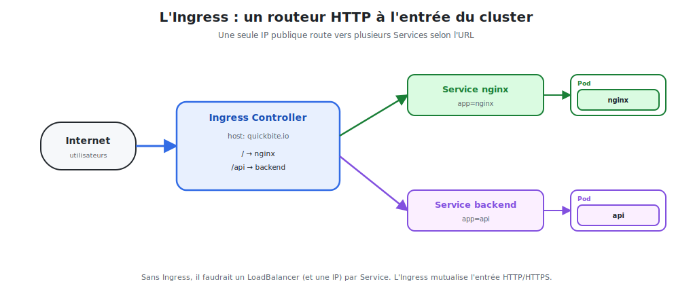

# L'Ingress : router le trafic HTTP

Exposer chaque service avec un `LoadBalancer` coûte **une IP publique par service**.
L'**Ingress** mutualise l'entrée : **une seule** porte HTTP/HTTPS qui route vers plusieurs
services selon l'**URL** et le **domaine**.



<p class="caption">Une seule IP publique route vers plusieurs Services selon l'URL ou le domaine.</p>

## 1. Le rôle de l'Ingress

L'Ingress est un **routeur HTTP/HTTPS de niveau 7** placé à l'entrée du cluster. Il sait :

- router selon le **chemin** : `/` → nginx, `/api` → backend ;
- router selon le **domaine** : `site-a.com` → service A, `site-b.com` → service B ;
- gérer le **TLS/HTTPS** de façon centralisée (un seul endroit pour les certificats).

| Approche | Coût | Souplesse |
|----------|------|-----------|
| Un LoadBalancer par service | une IP **par** service | aucune (pas de routage URL) |
| **Un Ingress** | **une** entrée mutualisée | routage par host **et** par chemin |

## 2. Attention : l'Ingress a besoin d'un contrôleur

> **Point clé souvent oublié :** l'objet `Ingress` n'est qu'un **ensemble de règles**. Pour
> qu'elles s'appliquent, il faut un **Ingress Controller** installé dans le cluster (le
> moteur qui lit les règles et route réellement le trafic).

Le plus courant est **ingress-nginx** (un nginx qui sert de routeur — encore lui !) :

```bash
# Sur minikube, une commande suffit
minikube addons enable ingress
kubectl get pods -n ingress-nginx        # le contrôleur tourne ?
```

## 3. Un Ingress qui expose nginx

On suppose un Service `nginx` (ClusterIP) déjà créé (module 05).

```yaml
apiVersion: networking.k8s.io/v1
kind: Ingress
metadata:
  name: nginx
  annotations:
    nginx.ingress.kubernetes.io/rewrite-target: /
spec:
  ingressClassName: nginx
  rules:
    - host: quickbite.local          # le domaine visé
      http:
        paths:
          - path: /
            pathType: Prefix
            backend:
              service:
                name: nginx          # le Service ciblé
                port:
                  number: 80
```

```bash
kubectl apply -f nginx-ingress.yaml
kubectl get ingress                  # voir l'adresse et les hosts
```

### Tester en local

```bash
# Récupérer l'IP du contrôleur, puis simuler le domaine
echo "$(minikube ip) quickbite.local" | sudo tee -a /etc/hosts
curl http://quickbite.local           # → servi par nginx
```

## 4. Router plusieurs services

L'intérêt de l'Ingress : un **seul** point d'entrée vers **plusieurs** services.

### Par chemin (path-based)

```yaml
rules:
  - host: quickbite.local
    http:
      paths:
        - path: /
          pathType: Prefix
          backend: { service: { name: nginx,   port: { number: 80 } } }
        - path: /api
          pathType: Prefix
          backend: { service: { name: backend, port: { number: 8080 } } }
```

→ `quickbite.local/` va vers nginx, `quickbite.local/api` va vers le backend.

### Par domaine (host-based)

```yaml
rules:
  - host: www.quickbite.local
    http: { paths: [ { path: /, pathType: Prefix,
            backend: { service: { name: nginx, port: { number: 80 } } } } ] }
  - host: api.quickbite.local
    http: { paths: [ { path: /, pathType: Prefix,
            backend: { service: { name: backend, port: { number: 8080 } } } } ] }
```

## 5. Activer HTTPS (TLS)

On réutilise un **Secret TLS** (module 06) et on l'attache à l'Ingress :

```yaml
spec:
  tls:
    - hosts:
        - quickbite.local
      secretName: nginx-tls         # le Secret type kubernetes.io/tls
  rules:
    - host: quickbite.local
      # ... mêmes règles
```

Le **certificat est géré au niveau de l'Ingress** : les Pods nginx, eux, restent en HTTP
simple. (Avec *cert-manager*, on peut même obtenir des certificats Let's Encrypt
automatiquement.)

## 6. Le chemin complet du trafic

```
Internet → Ingress Controller → Service (ClusterIP) → Pods nginx
           (routage par URL/host)  (load-balancing)     (le conteneur)
```

| Couche | Décide… |
|--------|---------|
| **Ingress** | **vers quel Service** envoyer (selon l'URL/host) |
| **Service** | **vers quel Pod** (load-balancing par label) |
| **Pod** | exécute nginx |

> **À retenir :** Ingress = routeur HTTP mutualisé à l'entrée du cluster. Il a besoin d'un
> *Ingress Controller*, il route par host/chemin et centralise le TLS. C'est la façon
> standard d'exposer des applications web sur Internet.
