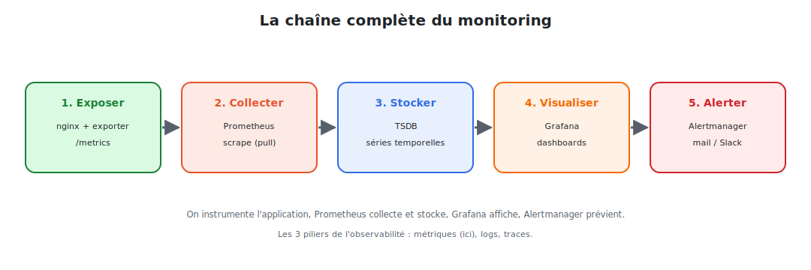

# Introduction : l'observabilité

## 1. Le problème : « est-ce que ça marche ? »

Votre application nginx tourne en production. Mais :

- Combien de requêtes traite-t-elle **par seconde** ?
- Le **taux d'erreurs** augmente-t-il ?
- La **latence** se dégrade-t-elle ?
- La mémoire va-t-elle **saturer** dans une heure ?
- Si ça tombe à 3 h du matin, **qui est prévenu** — et comment ?

Sans **monitoring**, on découvre les pannes… quand les utilisateurs se plaignent. L'objectif
est de **voir venir** les problèmes et de **comprendre** ce qui se passe à l'intérieur.

## 2. Les trois piliers de l'observabilité

| Pilier | Question | Exemple |
|--------|----------|---------|
| **Métriques** | « combien ? » (chiffres dans le temps) | 1 200 req/s, 2 % d'erreurs, 80 Mo de RAM |
| **Logs** | « que s'est-il passé ? » (événements) | « 500 Internal Server Error sur /api » |
| **Traces** | « où est passé le temps ? » (parcours d'une requête) | 40 ms en base, 10 ms en cache |

> Ce cours se concentre sur les **métriques** — le pilier le plus mature pour le monitoring
> et l'alerting — avec le duo standard **Prometheus + Grafana**.

## 3. La solution : Prometheus + Grafana

| Outil | Rôle | Analogie |
|-------|------|----------|
| **Prometheus** | **collecte** et **stocke** les métriques, les interroge, déclenche les alertes | le capteur + la mémoire |
| **Grafana** | **visualise** les métriques en tableaux de bord | l'écran de contrôle |
| **Alertmanager** | **route** et envoie les alertes (mail, Slack…) | la sonnette |

Ce trio est devenu le **standard de fait** du monitoring cloud-native, au cœur de
l'écosystème Kubernetes (projets de la CNCF, comme Kubernetes lui-même).

## 4. La chaîne complète



<p class="caption">Exposer → collecter → stocker → visualiser → alerter : les cinq maillons du monitoring.</p>

1. **Exposer** : l'application (nginx + un exporter) publie ses métriques sur `/metrics`.
2. **Collecter** : Prometheus va les **chercher** (pull) à intervalle régulier.
3. **Stocker** : il les range dans sa base de séries temporelles (TSDB).
4. **Visualiser** : Grafana interroge Prometheus et trace des courbes.
5. **Alerter** : si une condition est dépassée, Alertmanager **notifie**.

## 5. Notre fil rouge : superviser nginx

Comme dans les cours précédents, **nginx** sert d'exemple concret. On va :

- exposer les métriques de nginx (via le **nginx-prometheus-exporter**) ;
- les collecter avec **Prometheus** ;
- écrire des requêtes **PromQL** (taux de requêtes, % d'erreurs, latence) ;
- bâtir un **dashboard Grafana** ;
- créer une **alerte** « taux d'erreurs trop élevé » et la router vers Slack.

## 6. Pourquoi le modèle « pull » de Prometheus ?

Contrairement à d'autres systèmes où l'application **envoie** ses métriques (push),
Prometheus **va les chercher** (pull) sur `/metrics`.

| Avantage du pull | Conséquence |
|------------------|-------------|
| Prometheus sait si une cible est **down** | la non-réponse est elle-même un signal |
| Pas de configuration côté application | l'app expose, Prometheus découvre |
| Maîtrise du **rythme** de collecte | un seul endroit règle la fréquence |
| Simple à tester | il suffit d'ouvrir `/metrics` dans un navigateur |

## 7. Démarrer en local

```bash
# Prometheus en conteneur
docker run -p 9090:9090 prom/prometheus
# → interface : http://localhost:9090

# Grafana en conteneur
docker run -p 3000:3000 grafana/grafana
# → interface : http://localhost:3000  (admin / admin)
```

> **Pré-requis :** des bases de Docker et, idéalement, de Kubernetes (le module final
> déploie la stack sur un cluster). Aucune connaissance préalable de Prometheus n'est requise.

Dans le module suivant, on décortique l'architecture de Prometheus.
