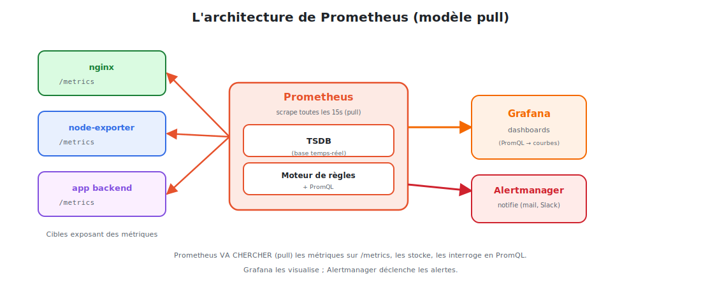

# L'architecture de Prometheus

Prometheus repose sur une idée simple : **aller chercher** (pull) des métriques exposées en
HTTP, les **stocker** dans une base temporelle, et les rendre **interrogeables**.



<p class="caption">Prometheus scrape les cibles sur /metrics, stocke dans la TSDB, et sert Grafana & Alertmanager.</p>

## 1. Le scraping : le cœur du système

Prometheus interroge périodiquement (par défaut **toutes les 15 s**) l'endpoint `/metrics`
de chaque **cible** (target). Cet endpoint renvoie un texte simple :

```
# HELP nginx_http_requests_total Nombre total de requêtes HTTP
# TYPE nginx_http_requests_total counter
nginx_http_requests_total{method="GET",status="200"} 1027
nginx_connections_active 12
```

Chaque ligne = une **métrique** + ses **labels** + sa **valeur**. Prometheus lit, horodate
et stocke. C'est tout.

## 2. Les composants

| Composant | Rôle |
|-----------|------|
| **Serveur Prometheus** | scrape, stocke (TSDB), évalue les règles, expose PromQL |
| **TSDB** | base de **séries temporelles** locale (sur disque) |
| **Exporters** | traduisent l'état d'un système en métriques `/metrics` |
| **Pushgateway** | pour les jobs courts qui ne peuvent pas être « pullés » |
| **Alertmanager** | reçoit les alertes, les route et notifie (module 05) |

## 3. La configuration : `prometheus.yml`

Tout se déclare dans un fichier YAML. Le concept clé : les **jobs** de scraping.

```yaml
global:
  scrape_interval: 15s          # fréquence de collecte par défaut
  evaluation_interval: 15s      # fréquence d'évaluation des règles

scrape_configs:
  - job_name: 'nginx'
    static_configs:
      - targets: ['nginx-exporter:9113']    # où scraper

  - job_name: 'prometheus'
    static_configs:
      - targets: ['localhost:9090']         # Prometheus se surveille lui-même
```

Recharger la configuration sans redémarrer :

```bash
curl -X POST http://localhost:9090/-/reload     # si --web.enable-lifecycle
```

## 4. Vérifier les cibles

Dans l'interface web (`http://localhost:9090`), le menu **Status ▸ Targets** liste chaque
cible et son état :

| État | Signification |
|------|---------------|
| `UP` | la cible répond, métriques collectées |
| `DOWN` | la cible ne répond pas → **c'est déjà une information** |

> **Le « down » est un signal.** Comme Prometheus va chercher les métriques, l'absence de
> réponse indique en soi un problème (cible tombée, réseau coupé). On peut alerter dessus
> avec la métrique spéciale `up == 0`.

## 5. La découverte dynamique (service discovery)

Lister les cibles « en dur » (`static_configs`) ne tient pas sur un cluster où les Pods
vont et viennent. Prometheus sait **découvrir** automatiquement les cibles :

| Mécanisme | Découvre… |
|-----------|-----------|
| `kubernetes_sd_configs` | les Pods/Services/Nodes d'un cluster K8s |
| `dns_sd_configs` | via des enregistrements DNS |
| `consul_sd_configs` | via Consul |
| `file_sd_configs` | via des fichiers générés |

```yaml
scrape_configs:
  - job_name: 'kubernetes-pods'
    kubernetes_sd_configs:
      - role: pod          # découvre tous les Pods automatiquement
```

→ tout Pod **annoté** `prometheus.io/scrape: "true"` est collecté **automatiquement**, sans
toucher à la config. C'est ce qui rend Prometheus naturel sur Kubernetes.

## 6. Le stockage TSDB

- Les données sont stockées **localement**, optimisées pour les séries temporelles.
- Rétention par défaut : **15 jours** (réglable via `--storage.tsdb.retention.time`).
- Pour du **long terme** ou du **multi-cluster**, on ajoute un stockage distant
  (**Thanos**, **Mimir**, **Cortex**).

## 7. L'interface intégrée

`http://localhost:9090` offre déjà :

- un **explorateur de requêtes** PromQL (onglet *Graph*) ;
- l'état des **cibles** (*Status ▸ Targets*) ;
- les **règles** et **alertes** actives (*Alerts*) ;
- la configuration chargée (*Status ▸ Configuration*).

> Cette UI suffit pour explorer et déboguer. Pour des **tableaux de bord** présentables et
> partagés, on branche **Grafana** (module 04).

> **À retenir :** Prometheus **pull** sur `/metrics`, stocke en TSDB, et découvre ses
> cibles dynamiquement sur Kubernetes. Le module suivant : **ce que** contient `/metrics`.
