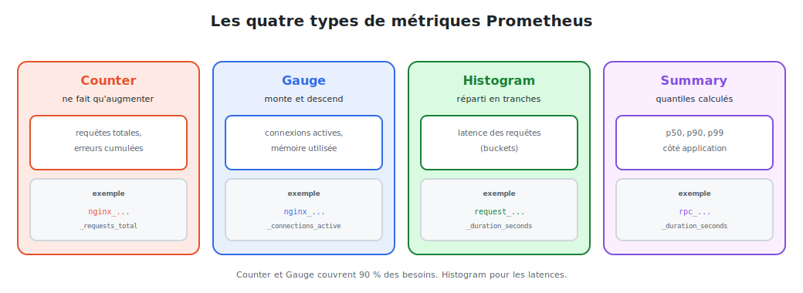

# Les métriques : types & instrumentation

Une métrique Prometheus est un **nombre mesuré dans le temps**, identifié par un **nom** et
des **labels**. Tout repose sur quatre types fondamentaux.



<p class="caption">Counter, Gauge, Histogram, Summary : choisir le bon type selon ce qu'on mesure.</p>

## 1. Anatomie d'une métrique

```
nginx_http_requests_total{method="GET", status="200"}  1027
└──────────┬───────────┘ └────────────┬────────────┘  └─┬─┘
      nom de la métrique        labels (dimensions)    valeur
```

- **Nom** : ce qu'on mesure (convention : `unité` en suffixe, ex. `_total`, `_seconds`, `_bytes`).
- **Labels** : des **dimensions** qui découpent la métrique (par méthode, par statut, par
  instance…). Ils permettent de filtrer et d'agréger.
- **Valeur** : le nombre, horodaté au moment du scrape.

> **Attention à la cardinalité.** Chaque combinaison de labels crée une **série** distincte.
> Mettre un label à forte variabilité (un ID utilisateur, une URL unique) fait **exploser**
> le nombre de séries et sature Prometheus. Labels = **petites** catégories stables.

## 2. Les quatre types de métriques

### Counter — ne fait qu'augmenter

Un compteur **cumulatif** qui ne peut que **croître** (ou repartir de zéro au redémarrage).

```
nginx_http_requests_total      # requêtes totales depuis le démarrage
nginx_http_errors_total        # erreurs cumulées
```

On ne lit presque jamais sa valeur brute : on calcule son **taux** avec `rate()` (module 03).

### Gauge — monte et descend

Une valeur **instantanée** qui peut augmenter **ou** diminuer.

```
nginx_connections_active       # connexions ouvertes maintenant
node_memory_used_bytes         # mémoire utilisée
node_cpu_usage_ratio           # charge CPU
```

### Histogram — réparti en tranches (buckets)

Mesure une **distribution** (typiquement des **latences**) en comptant les observations par
**tranches** (`_bucket`), plus une somme (`_sum`) et un nombre (`_count`).

```
http_request_duration_seconds_bucket{le="0.1"}   980    # ≤ 100 ms
http_request_duration_seconds_bucket{le="0.5"}   1015   # ≤ 500 ms
http_request_duration_seconds_sum                52.3
http_request_duration_seconds_count              1027
```

→ permet de calculer un **quantile** (p95, p99) avec `histogram_quantile()`.

### Summary — quantiles pré-calculés

Comme l'histogram, mais les **quantiles** sont calculés **côté application**. Plus précis
mais non agrégeable entre instances. On lui préfère souvent l'**histogram**.

### Lequel choisir ?

| Je mesure… | Type |
|------------|------|
| un total qui s'accumule (requêtes, erreurs, octets) | **Counter** |
| une valeur qui varie (connexions, mémoire, température) | **Gauge** |
| une distribution / des latences agrégeables | **Histogram** |
| des quantiles précis sur une seule instance | **Summary** |

## 3. Exposer des métriques : les exporters

Beaucoup de logiciels n'exposent pas nativement du format Prometheus. Un **exporter** fait
la traduction : il lit l'état du système et publie un `/metrics`.

| Exporter | Expose les métriques de… |
|----------|--------------------------|
| **node-exporter** | la machine (CPU, RAM, disque, réseau) |
| **nginx-prometheus-exporter** | **nginx** (notre cas) |
| **blackbox-exporter** | sondes externes (ping, HTTP, TLS) |
| **postgres / redis exporter** | bases de données |

### Notre cas : superviser nginx

nginx publie un endpoint d'état (`stub_status`) ; l'exporter le convertit en métriques
Prometheus.

```bash
# nginx avec le module stub_status activé, puis l'exporter en sidecar
docker run -p 9113:9113 nginx/nginx-prometheus-exporter:latest \
  -nginx.scrape-uri=http://nginx:8080/stub_status
# → métriques disponibles sur http://localhost:9113/metrics
```

```
nginx_connections_active 12
nginx_connections_accepted_total 9876
nginx_http_requests_total 10234
```

## 4. Instrumenter sa propre application

Pour une application maison, on utilise une **bibliothèque client** Prometheus (Go, Python,
Java, Node…). Exemple en Python :

```python
from prometheus_client import Counter, start_http_server

REQUESTS = Counter('app_requests_total', 'Requêtes', ['method', 'status'])

def handle(req):
    REQUESTS.labels(method=req.method, status='200').inc()

start_http_server(8000)   # expose /metrics sur le port 8000
```

## 5. La méthode RED : quoi mesurer en priorité

Pour un service comme nginx, trois métriques suffisent à savoir s'il va bien :

| Lettre | Métrique | Avec nginx |
|--------|----------|------------|
| **R**ate | requêtes par seconde | `rate(nginx_http_requests_total[5m])` |
| **E**rrors | taux d'erreurs | part des `status="5.."` |
| **D**uration | latence | histogram des durées de requête |

> (Pour les **ressources** d'une machine, la méthode sœur **USE** — Utilization,
> Saturation, Errors — guide ce qu'il faut surveiller : CPU, mémoire, disque.)

> **À retenir :** nom + labels + valeur ; quatre types (Counter/Gauge/Histogram/Summary) ;
> on expose via des **exporters** ; on priorise avec **RED**. Place aux requêtes : **PromQL**.
