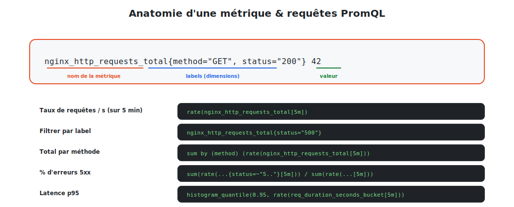

# PromQL : interroger les métriques

**PromQL** (Prometheus Query Language) est le langage qui transforme des séries brutes en
informations utiles : taux, pourcentages, agrégations, quantiles.



<p class="caption">D'une métrique brute aux requêtes qui répondent aux vraies questions.</p>

## 1. La requête la plus simple : sélectionner

```promql
nginx_http_requests_total
```

→ renvoie **toutes** les séries de cette métrique (une par combinaison de labels).

### Filtrer par label

```promql
nginx_http_requests_total{status="500"}            # égalité
nginx_http_requests_total{status!="200"}           # différent
nginx_http_requests_total{status=~"5.."}           # regex : tout 5xx
nginx_http_requests_total{method="GET", status="200"}   # plusieurs labels
```

## 2. Les quatre types de résultats

| Type | Quoi | Exemple |
|------|------|---------|
| **Instant vector** | une valeur par série, à l'instant t | `nginx_connections_active` |
| **Range vector** | une plage de valeurs sur une durée | `nginx_http_requests_total[5m]` |
| **Scalar** | un nombre simple | `42` |
| **String** | une chaîne | (rare) |

## 3. `rate()` : le taux par seconde d'un counter

**La** fonction la plus utilisée. Un counter ne fait qu'augmenter : sa valeur brute n'a pas
d'intérêt. Ce qu'on veut, c'est sa **vitesse de croissance**.

```promql
rate(nginx_http_requests_total[5m])
```

→ « combien de requêtes **par seconde**, en moyenne sur les 5 dernières minutes ». C'est la
métrique **R** de RED (le débit).

> **`rate` exige un range vector** (`[5m]`) et **un counter**. Il gère automatiquement les
> redémarrages (remise à zéro du compteur). Pour les pics brefs, `irate()` est plus réactif.

## 4. Agréger avec `sum`, `avg`, `by`, `without`

Les **opérateurs d'agrégation** combinent plusieurs séries.

```promql
# Total des requêtes/s, toutes séries confondues
sum(rate(nginx_http_requests_total[5m]))

# Requêtes/s regroupées PAR méthode
sum by (method) (rate(nginx_http_requests_total[5m]))

# Moyenne d'utilisation CPU par instance
avg by (instance) (rate(node_cpu_seconds_total[5m]))
```

| Opérateur | Effet |
|-----------|-------|
| `sum`, `avg`, `min`, `max` | agrègent les valeurs |
| `count` | compte les séries |
| `by (label)` | **groupe** par ce(s) label(s) |
| `without (label)` | agrège en **ignorant** ce label |
| `topk(3, ...)` | le top 3 |

## 5. Calculer un pourcentage d'erreurs

Un grand classique — la métrique **E** de RED :

```promql
sum(rate(nginx_http_requests_total{status=~"5.."}[5m]))
/
sum(rate(nginx_http_requests_total[5m]))
```

→ proportion de requêtes en erreur 5xx. Multipliée par 100, c'est le **% d'erreurs**, parfait
pour une alerte (« > 5 % pendant 10 min »).

## 6. Les quantiles de latence (histogram)

La métrique **D** de RED, à partir d'un histogram :

```promql
histogram_quantile(
  0.95,
  sum by (le) (rate(http_request_duration_seconds_bucket[5m]))
)
```

→ la **latence p95** : 95 % des requêtes sont plus rapides que cette valeur.

## 7. Opérations et comparaisons

```promql
# Arithmétique
node_memory_used_bytes / node_memory_total_bytes * 100     # % mémoire

# Comparaisons (utiles pour les alertes — renvoie les séries qui matchent)
node_filesystem_avail_bytes < 10e9                          # disque < 10 Go
up == 0                                                     # cibles DOWN
```

## 8. Tableau récapitulatif des fonctions clés

| Fonction | Usage |
|----------|-------|
| `rate(counter[5m])` | taux/s moyen d'un counter |
| `irate(counter[5m])` | taux/s instantané (pics) |
| `increase(counter[1h])` | augmentation absolue sur la période |
| `sum / avg / max by (l)` | agrégation groupée |
| `histogram_quantile(0.95, ...)` | quantile depuis un histogram |
| `topk(5, ...)` | les 5 plus grandes valeurs |
| `predict_linear(metric[1h], 4*3600)` | prévoir la valeur dans 4 h |

## 9. Tester ses requêtes

Dans l'UI Prometheus (`http://localhost:9090`, onglet **Graph**) : on tape la requête, on
voit la **table** et la **courbe** immédiatement. C'est le terrain de jeu idéal pour
construire ses requêtes avant de les mettre dans un dashboard ou une alerte.

> **À retenir :** `rate()` sur les counters, agrégation avec `sum ... by`, `% d'erreurs`
> par division, `histogram_quantile` pour les latences. Ces quatre patterns couvrent
> l'essentiel. Place à la **visualisation** : Grafana.
