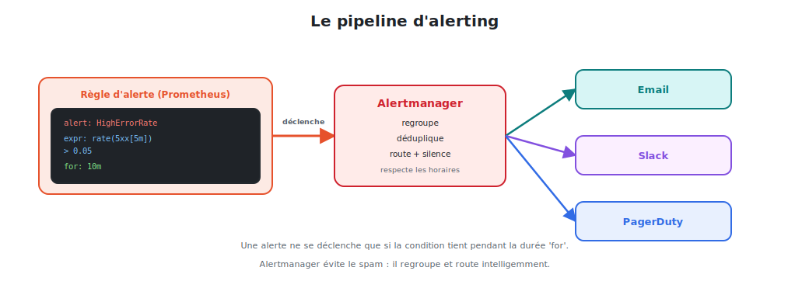

# L'alerting : être prévenu à temps

Visualiser ne suffit pas : personne ne regarde un dashboard à 3 h du matin. L'**alerting**
déclenche une notification **automatique** quand une condition est dépassée.



<p class="caption">Prometheus évalue les règles ; Alertmanager regroupe, route et notifie.</p>

## 1. Deux étapes, deux composants

| Étape | Composant | Rôle |
|-------|-----------|------|
| **Détecter** | **Prometheus** | évalue des **règles** PromQL en continu |
| **Notifier** | **Alertmanager** | regroupe, route et **envoie** (mail, Slack…) |

Cette séparation est volontaire : Prometheus dit **quoi** se passe ; Alertmanager décide
**qui** prévenir et **comment**.

## 2. Écrire une règle d'alerte

Les règles vivent dans un fichier chargé par Prometheus (`rule_files:` dans `prometheus.yml`).

```yaml
groups:
  - name: nginx
    rules:
      - alert: HighErrorRate
        expr: |
          sum(rate(nginx_http_requests_total{status=~"5.."}[5m]))
          / sum(rate(nginx_http_requests_total[5m])) > 0.05
        for: 10m                     # la condition doit tenir 10 min
        labels:
          severity: critical
        annotations:
          summary: "Taux d'erreurs 5xx élevé sur nginx"
          description: "Plus de 5 % d'erreurs depuis 10 minutes."
```

### Les champs clés

| Champ | Rôle |
|-------|------|
| `alert` | nom de l'alerte |
| `expr` | la **condition** PromQL ; l'alerte se déclenche si elle renvoie des séries |
| `for` | durée pendant laquelle la condition doit **persister** avant de déclencher |
| `labels` | métadonnées (ex. `severity`) servant au **routage** |
| `annotations` | texte humain (`summary`, `description`) pour la notification |

> **Le champ `for` évite les faux positifs.** Un pic d'erreurs d'une seconde ne réveille
> personne ; seul un problème qui **dure** 10 minutes déclenche l'alerte.

## 3. Le cycle de vie d'une alerte

| État | Signification |
|------|---------------|
| `inactive` | la condition est fausse |
| `pending` | la condition est vraie, mais `for` n'est pas encore écoulé |
| `firing` | la condition tient depuis `for` → envoyée à Alertmanager |

On suit ces états dans l'UI Prometheus, onglet **Alerts**.

## 4. Alertmanager : router intelligemment

Une fois l'alerte `firing`, Alertmanager prend le relais. Sa configuration
(`alertmanager.yml`) définit le **routage** et les **destinataires**.

```yaml
route:
  receiver: 'equipe-ops'           # destinataire par défaut
  group_by: ['alertname']          # regrouper les alertes similaires
  group_wait: 30s                  # attendre 30s avant le premier envoi
  repeat_interval: 4h              # ré-notifier toutes les 4h si non résolu
  routes:
    - match:
        severity: critical         # les alertes critiques...
      receiver: 'pagerduty'        # ...vont vers l'astreinte

receivers:
  - name: 'equipe-ops'
    slack_configs:
      - channel: '#alertes'
        api_url: '<webhook-slack>'
  - name: 'pagerduty'
    pagerduty_configs:
      - service_key: '<clé>'
```

## 5. Ce qu'Alertmanager apporte (et qu'une simple notification n'a pas)

| Fonction | Pourquoi c'est essentiel |
|----------|--------------------------|
| **Regroupement** (`group_by`) | 50 Pods qui tombent = **1** notification, pas 50 |
| **Déduplication** | la même alerte de plusieurs Prometheus = une seule notif |
| **Routage** (`routes`) | critique → astreinte, info → Slack |
| **Silences** | couper le bruit pendant une maintenance planifiée |
| **Inhibition** | si « cluster down », taire les alertes « Pod down » dérivées |
| **`repeat_interval`** | rappeler tant que ce n'est pas résolu |

## 6. Bonnes pratiques d'alerting

- **Alerter sur les symptômes, pas les causes** : « le service répond en erreur » (vécu par
  l'utilisateur) plutôt que « le CPU est à 90 % » (qui n'est pas forcément un problème).
- **Toujours un `for`** pour éviter les alertes qui clignotent.
- **Des annotations utiles** : que faire ? quel dashboard consulter ? (runbook).
- **Graduer la `severity`** : `critical` réveille quelqu'un, `warning` attend le matin.
- **Tester les alertes** : provoquer la condition pour vérifier que la notif arrive.
- **Éviter la fatigue d'alerte** : trop d'alertes = on les ignore. Mieux vaut **peu**
  d'alertes **pertinentes**.

## 7. Une alerte universelle : la cible est tombée

```yaml
- alert: TargetDown
  expr: up == 0
  for: 5m
  labels: { severity: critical }
  annotations:
    summary: "Cible {{ $labels.job }} injoignable"
```

Grâce au modèle pull, `up == 0` détecte qu'une cible (nginx, un node…) ne répond plus —
souvent la **première** chose à surveiller.

> **À retenir :** Prometheus **détecte** via des règles PromQL avec un `for` ; Alertmanager
> **route et notifie** sans spammer. On alerte sur les **symptômes** visibles par
> l'utilisateur, avec parcimonie. C'est le maillon qui rend le monitoring **actionnable**.
